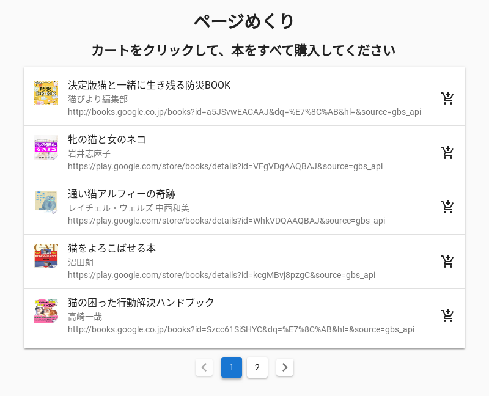
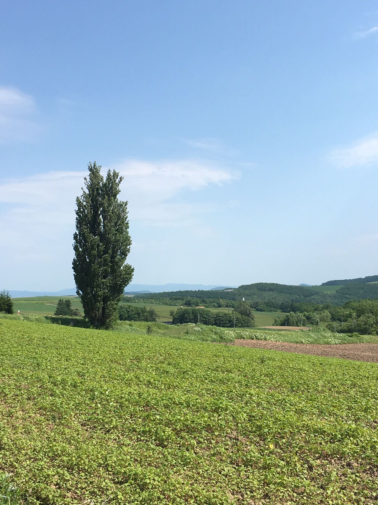
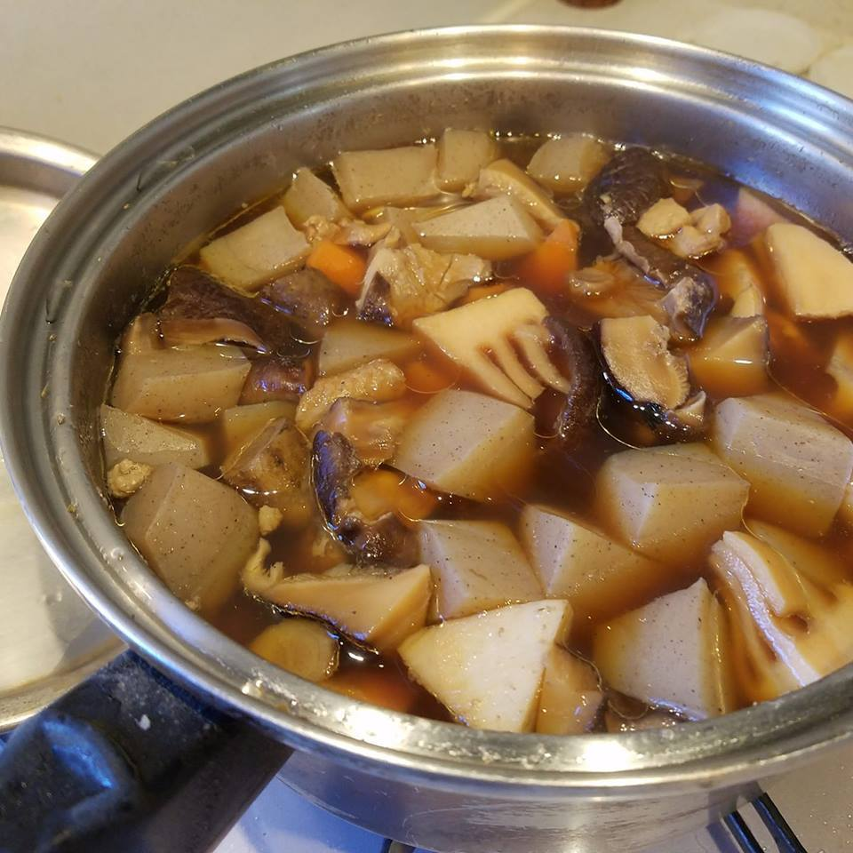

# ComputerVision

OCR（画像からの文字起こし）などの画像認識を取り扱うアクションです。Google社のVision APIを用いています。（＊このアクションは、ベータです）

## TextDetection

### 概要

TextDetectionは、画像データからテキストを検出するアクションです。

### パラメーター

\*は、必須パラメーター

| 名前 | 型 | 概要 | 例 |
| :--- | :--- | :--- | :--- |
| image\* | 文字列、画像、ファイル | 画像ファイルのパス | +take\_screenshot\_1 |
| mode | 文字列 | モード選択。写真の中から文字を検出する場合は、text。書籍、書類などの文書から文字を検出するときは、documentを指定。 | document\(default\) |
| text\_only | 真理値 | アウトプットの形式。trueにした場合、テキストのみ。falseにした場合、JSON形式。 | true\(default\) |

### アウトプット

| タイプ | 型 | 概要 | 例 |
| :--- | :--- | :--- | :--- |
| JSON | JSON形式 | 検出結果 | ※使用例のアウトプット参照 |

### 使用例

TakeScreenshotアクションでとった画像ファイルから、テキストを検出。

```yaml
+text_detection_1:
  action>: TextDetection
  image: +take_screenshot_1
  mode: text
  text_only: true
# => "ページめくり\nカートをクリックして、本をすべて購入してください\n決定版猫と一緒に生き残る防災BOOK\n猫びより編集部\nhttp://books.google.co.jp/books?id-a5JSvWEACAAJ&dqs%E7%8C%AB&hl=&source-gbs_api\n%,\n150)。\n牝の猫と女のネコ\nERA\nrep\n岩井志麻子\nhttps://play.google.com/store/books/details?id-VFgVDgAAQBAJ&source-gbs_api\n通い猫アルフィーの奇跡\nレイチェル·ウェルズ中西和美\nhttps://play.google.com/store/books/details?id-WhkVDQAAQBAJ&source-gbs_api\n猫をよろこばせる本\n沼田朗\nhttps://play.google.com/store/books/details?id-kog MBvj8pzgC&source=gbs_api\n猫の困った行動解決ハンドブック\nhttp://books.google.co.jp/books?id-Szcc61 SiSHYC&dq=%E7%8C%AB&hl=&sourcesqbs_api\n"
```



## FaceDetection

### 概要

FaceDetectionは、画像データから顔と感情を検出するアクションです。

### パラメーター

\*は、必須パラメーター

| 名前 | 型 | 概要 | 例 |
| :--- | :--- | :--- | :--- |
| image\* | 文字列、画像、ファイル | 画像ファイルのパス | +download\_file\_1 |
| simple\_mode | 真理値 | モード選択。trueにした場合、アウトプットが簡略された表現（テキスト）になります。 | false\(default\) |

### アウトプット

| タイプ | 型 | 概要 | 例 |
| :--- | :--- | :--- | :--- |
| JSON | JSON形式 | 検出結果 | ※使用例のアウトプット参照 |

### 使用例

URL上からダウンロードした画像ファイルから、顔と感情を検出。

```yaml
+face_detection_1:
  action>: FaceDetection
  image: +download_file_1
  simple_mode: true
# => "1 face(s) detected\njoy (VERY_LIKELY)\nsorrow (VERY_UNLIKELY)\nanger (VERY_UNLIKELY)\nsurprise (VERY_UNLIKELY)\nunderExposed (VERY_UNLIKELY)\nblurred (VERY_UNLIKELY)\nheadwear (VERY_UNLIKELY)"
```


## ImageProperties

### 概要

ImagePropertiesは、画像の色味など一般的な情報を抽出するアクションです。

### パラメーター

\*は、必須パラメーター

| 名前 | 型 | 概要 | 例 |
| :--- | :--- | :--- | :--- |
| image\* | 文字列、画像、ファイル | 画像ファイルのパス | +download\_file\_1 |
| simple\_mode | 真理値 | モード選択。trueにした場合、アウトプットが簡略された表現（テキスト）になります。 | false\(default\) |

### アウトプット

| タイプ | 型 | 概要 | 例 |
| :--- | :--- | :--- | :--- |
| JSON | JSON形式 | 検出結果 | ※使用例のアウトプット参照 |

### 使用例

URL上からダウンロードした画像ファイルから、色味など一般的な情報を抽出を抽出。

```yaml
+image_properties_1:
  action>: ImageProperties
  image: +download_file_1
  simple_mode: true
# => "[0.235] rgba(202, 226, 245, null)\n[0.196] rgba(145, 187, 233, null)\n[0.055] rgba(70, 92, 82, null)\n[0.047] rgba(43, 54, 47, null)\n[0.046] rgba(105, 125, 89, null)\n[0.032] rgba(141, 156, 80, null)\n[0.109] rgba(166, 203, 238, null)\n[0.043] rgba(69, 88, 61, null)\n[0.037] rgba(42, 58, 33, null)\n[0.024] rgba(116, 131, 64, null)"
```



## LabelDetection

### 概要

LabelDetectionは、画像のカテゴリや、写っている物体を検出するアクションです。

### パラメーター

\*は、必須パラメーター

| 名前 | 型 | 概要 | 例 |
| :--- | :--- | :--- | :--- |
| image\* | 文字列、画像、ファイル | 画像ファイルのパス | +download\_file\_1 |
| simple\_mode | 真理値 | モード選択。trueにした場合、アウトプットが簡略された表現（テキスト）になります。 | false\(default\) |

### アウトプット

| タイプ | 型 | 概要 | 例 |
| :--- | :--- | :--- | :--- |
| JSON | JSON形式 | 検出結果 | ※使用例のアウトプット参照 |

### 使用例

URL上からダウンロードした画像のカテゴリや、写っている物体を抽出。

```yaml
+label_detection_1:
  action>: LabelDetection
  image: +download_file_1
  simple_mode: true
# => "[0.993] Dish\n[0.986] Cuisine\n[0.967] Food\n[0.921] Ingredient\n[0.709] Produce\n[0.658] Nikujaga\n[0.649] Recipe\n[0.648] Coddle\n[0.564] Irish stew\n[0.545] Stew"
```



## LogoDetection

### 概要

LogoDetectionは、画像に写っている商品ロゴを検出するアクションです。

### パラメーター

\*は、必須パラメーター

| 名前 | 型 | 概要 | 例 |
| :--- | :--- | :--- | :--- |
| image\* | 文字列、画像、ファイル | 画像ファイルのパス | +download\_file\_1 |
| simple\_mode | 真理値 | モード選択。trueにした場合、アウトプットが簡略された表現（テキスト）になります。 | false\(default\) |

### アウトプット

| タイプ | 型 | 概要 | 例 |
| :--- | :--- | :--- | :--- |
| JSON | JSON形式 | 検出結果 | ※使用例のアウトプット参照 |

### 使用例

URL上からダウンロードした画像に写っている商品ロゴを検出。

```yaml
+logo_detection_1:
  action>: LogoDetection
  image: +download_file_1
  simple_mode: true
# => "[0.956] coca cola classic"
```


## SafeSearchDetection

### 概要

SafeSearchDetectionは、画像に不適切コンテンツが含まれているかを検出するアクションです。

### パラメーター

\*は、必須パラメーター

| 名前 | 型 | 概要 | 例 |
| :--- | :--- | :--- | :--- |
| image\* | 文字列、画像、ファイル | 画像ファイルのパス | +download\_file\_1 |
| simple\_mode | 真理値 | モード選択。trueにした場合、アウトプットが簡略された表現（テキスト）になります。 | false\(default\) |

### アウトプット

| タイプ | 型 | 概要 | 例 |
| :--- | :--- | :--- | :--- |
| JSON | JSON形式 | 検出結果 | ※使用例のアウトプット参照 |

### 使用例

URL上からダウンロードした画像に不適切コンテンツが含まれているか検出。

```yaml
+safe_search_detection_1:
  action>: SafeSearchDetection
  image: +download_file_1
  simple_mode: true
# => "adult (VERY_UNLIKELY)\nspoof (UNLIKELY)\nmedical (VERY_UNLIKELY)\nviolence (VERY_UNLIKELY)\nracy (VERY_UNLIKELY)"
```


## WebDetection

### 概要

WebDetectionは、画像のWeb参照を検出するアクションです。

### パラメーター

\*は、必須パラメーター

| 名前 | 型 | 概要 | 例 |
| :--- | :--- | :--- | :--- |
| image\* | 文字列、画像、ファイル | 画像ファイルのパス | +download\_file\_1 |
| simple\_mode | 真理値 | モード選択。trueにした場合、アウトプットが簡略された表現（テキスト）になります。 | false\(default\) |

### アウトプット

| タイプ | 型 | 概要 | 例 |
| :--- | :--- | :--- | :--- |
| JSON | JSON形式 | 検出結果 | ※使用例のアウトプット参照 |

### 使用例

URL上からダウンロードした画像のWeb参照を検出。

```yaml
+web_detection_1:
  action>: WebDetection
  image: +download_file_1
  simple_mode: true
# => "Best guess labels: 授業 フリー 素材\n[0.813] Lesson\n[0.700] Teacher\n[0.681] Education\n[0.671] School\n[0.659] Learning\n[0.654] Student\n[0.584] Skill\n[0.579] Juku\n[0.547] Test\n[0.533] Classroom"
```


