#  Robotic Crowd Agentで既存のワークフローを実行する

## 概要

Robotic Crowd Agent を使って、既存のワークフローを実行する方法を説明します。

事前に、Chrome に Robotic Crowd Agent という拡張機能をインストールしている必要があります。
インストール方法は、[こちら](https://tutorial.co.jp/news/release/2019/06/rc_agent/#install) をご覧ください。

では、始めましょう。

### このチュートリアルのゴール

今回は既存のワークフローを実行していきます。
過去の記事で使用したワークフローをもう一度実行させていきます。

「REC」を使用した時、「EXTRACT DATA」を使用した時で少し方法が異なるのでそれぞれ解説します。

「REC」使用時の解説には、「Robotic Crowd Agent で連続した操作を記録する」という記事でのワークフローを使います。
「EXTRACT DATA」使用時の解説には、「Robotic Crowd Agent でウェブサイトのデータをCSVに抽出する」という記事でのワークフローを使います。

### 作業

手順  

1. 「REC」ボタン使用時の既存のワークフロー実行準備
1. 「REC」ボタン使用時のワークフローの実行を確認する
1. 「EXTRACT DATA」使用時の既存のワークフロー実行準備
1. 「EXTRACT DATA」使用時のワークフローの実行を確認する

### 1. 「REC」ボタン使用時の既存のワークフロー実行準備

「REC」使用時の解説には「Robotic Crowd Agent で連続した操作を記録する」という記事のワークフローを使います。

テキストエディタ等で残しておいたものを使用してください。
もし残していない場合は、お手数ですが「Robotic Crowd Agent で連続した操作を記録する」の記事で再度作成し、テキストエディタ等に残しておくことをお勧めします。

「Robotic Crowd Agent で連続した操作を記録する」の記事で作成したワークフローは以下の通りになります。

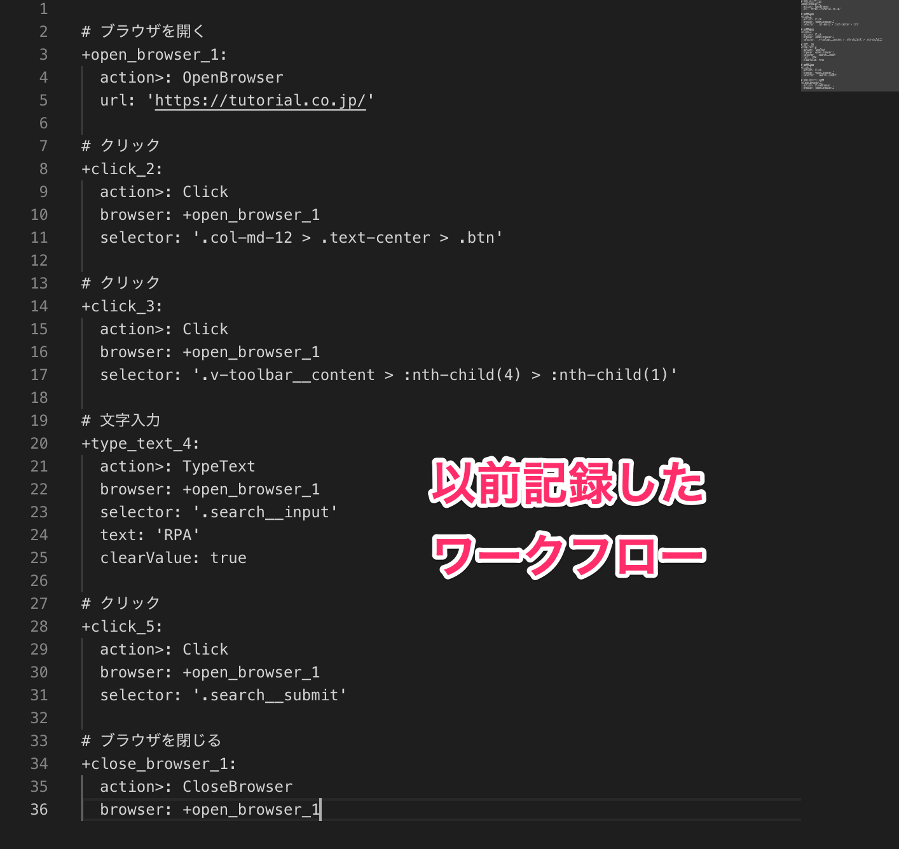

はじめに、株式会社チュートリアル（https://tutorial.co.jp）のホームページを開いてください。

Chrome のアドレスバー右側にある、猫のマークをクリックしてください。
すると、下図のように、ポップアップが表示されますので、「REC」を押してください。レコーディングを開始したら、何も操作せず、そのまま「STOP」を押してください。

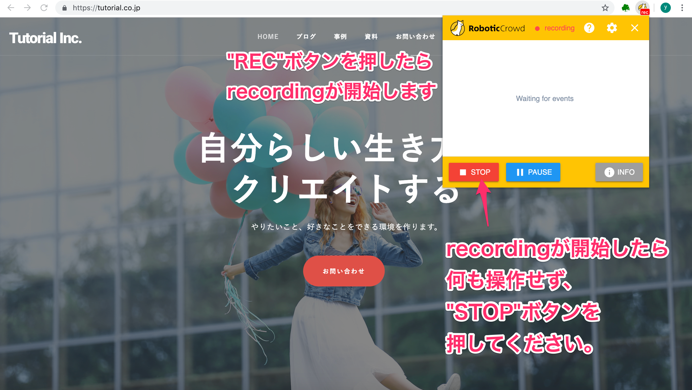

「STOP」を押すと今回のワークフローが記録されていることが分かりますが、ワークフローの部分は全消去してください。
 
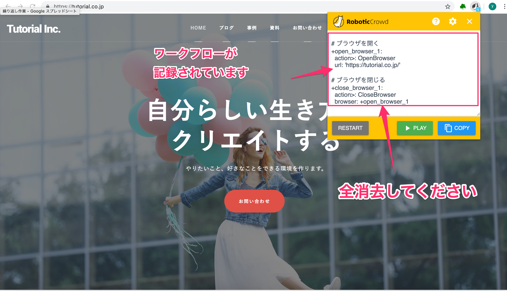  

全消去できましたら「Robotic Crowd Agent で連続した操作を記録する」という記事で記録されたワークフロー(1枚目の画像のもの)をペーストしてください。

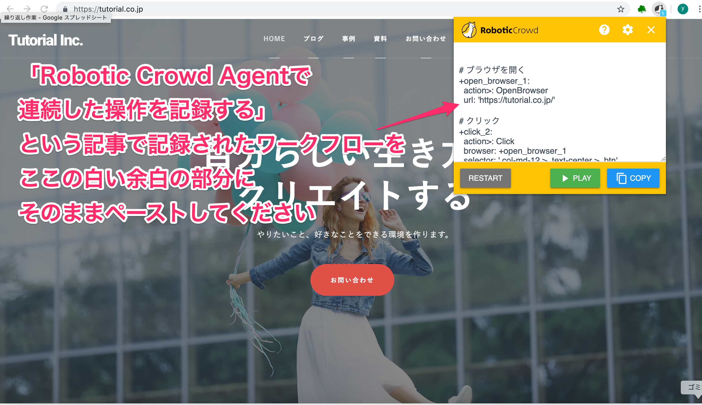  

### 2. 「REC」ボタン使用時のワークフローの実行を確認する

ペーストできましたら「PLAY」を押してください。ペーストした「Robotic Crowd Agent で連続した操作を記録する」の記事のワークフローが実行します。

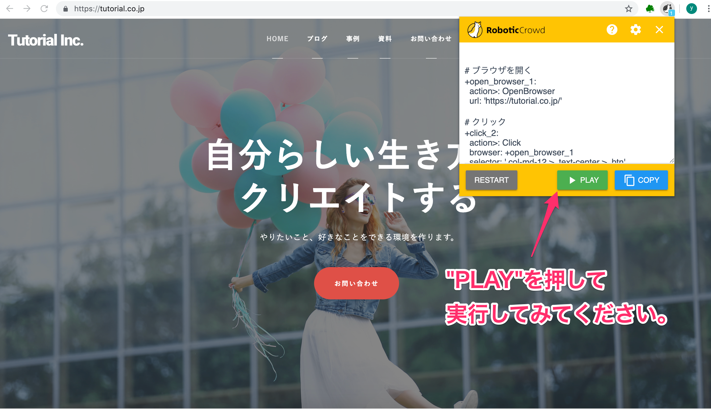

「Robotic Crowd Agentで連続した操作を記録する」の記事のワークフローと実行結果が同じになりました。

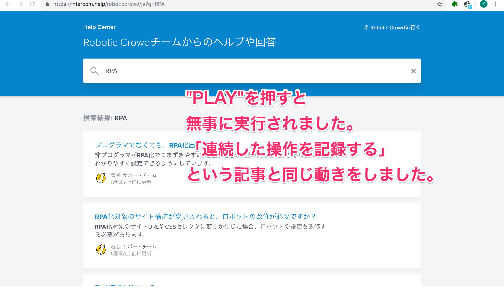  

「REC」使用時における、既存のワークフローの実行方法について説明しました。

### 3. 「EXTRACT DATA」使用時の既存のワークフロー実行準備

「EXTRACT DATA」使用時の解説には「 Robotic Crowd Agent でウェブサイトのデータをCSVに抽出する」という記事のワークフローを使います。
テキストエディタ等で残しておいたものを使用してください。
もし残していない場合は、お手数ですが「Robotic Crowd AgentでウェブサイトのデータをCSVに抽出する」の記事で再度作成し、テキストエディタ等に残しておくことをお勧めします。

「Robotic Crowd AgentでウェブサイトのデータをCSVに抽出する」の記事で作成したワークフローは以下の通りになります。

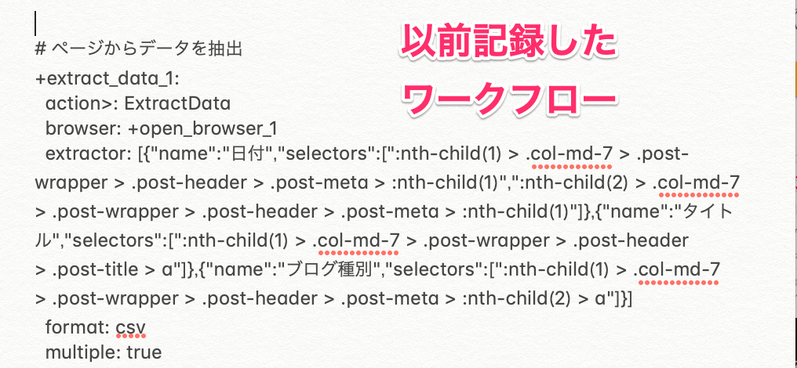

今回のワークフローはブログのページから始まります。
はじめに、株式会社チュートリアルのブログページ（https://tutorial.co.jp/blog/) を開いてください。
Chrome のアドレスバー右側にある、猫のマークをクリックしてください。
すると、下図のように、ポップアップが表示されますので、「EXTRACT DATA」を押してください。

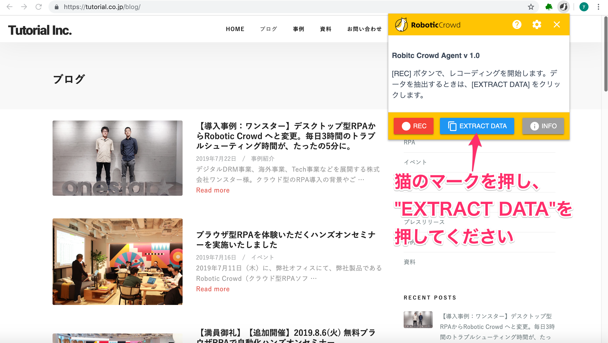

適当な場所をクリックして、データを抽出してください。
Data Nameの指定はありません、適当なものを入れていただいて構いません。
入力しましたら、次へを押してください。

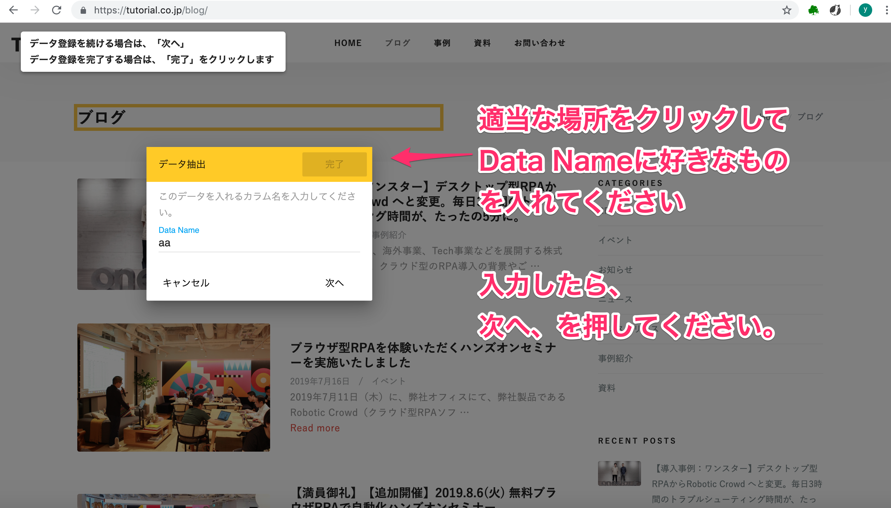

元のブログページの画面に戻りましたら、猫のマークを押して「STOP」を押してください。

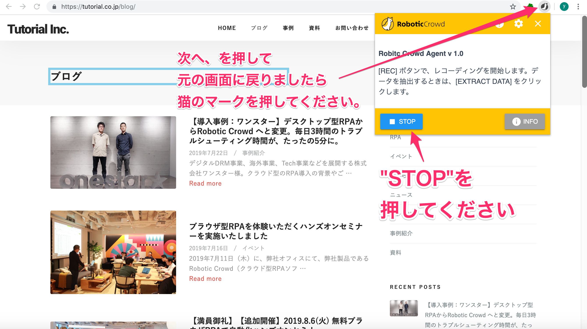  

「STOP」を押しましたら、今回作成したワークフローが記録されていることが分かります。記録されていますが、全消去してください。

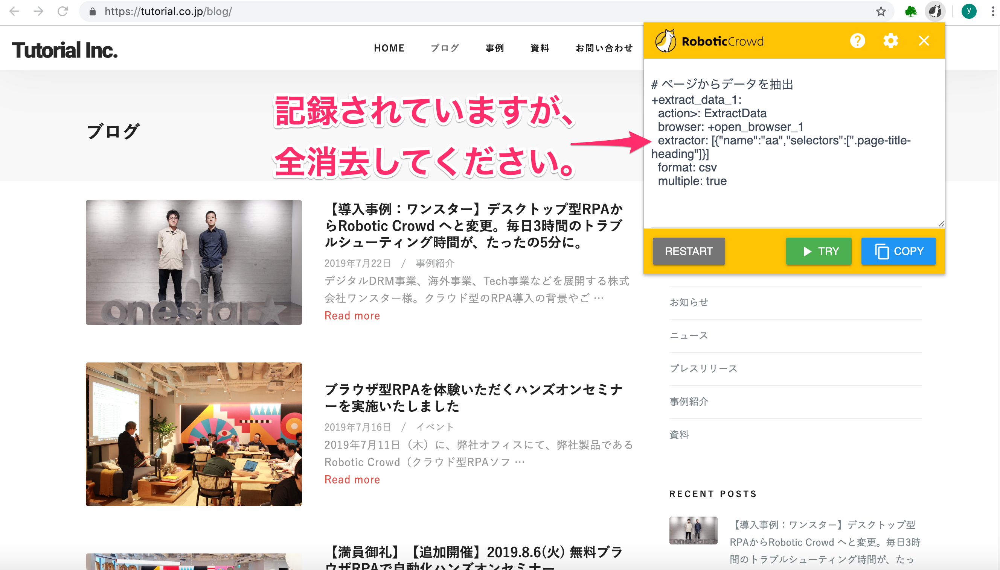

全消去しましたら、「 Robotic Crowd Agent でウェブサイトのデータをCSVに抽出する」という記事で作成したワークフローをペーストしてください。
ペーストできましたら「TRY」を押して実行してください。

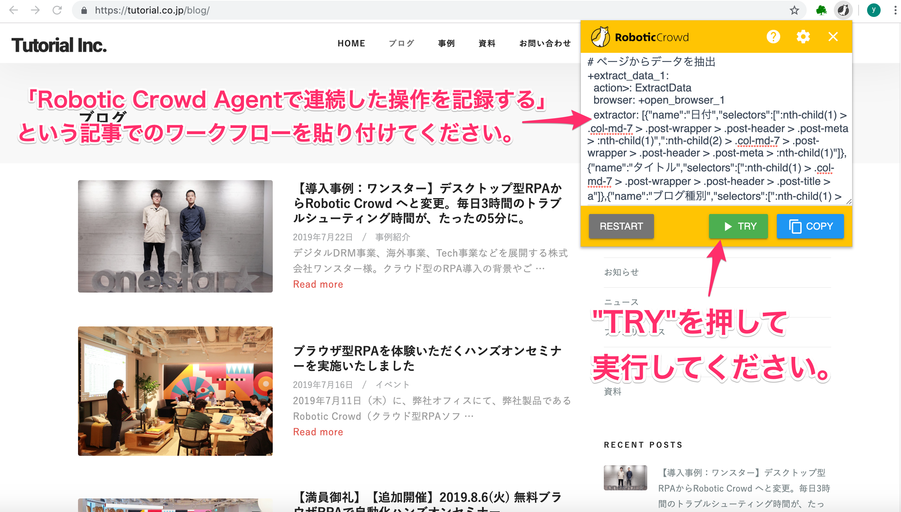

実行すると、データを抽出できました。
続いて、ダウンロードCSVも押してください。

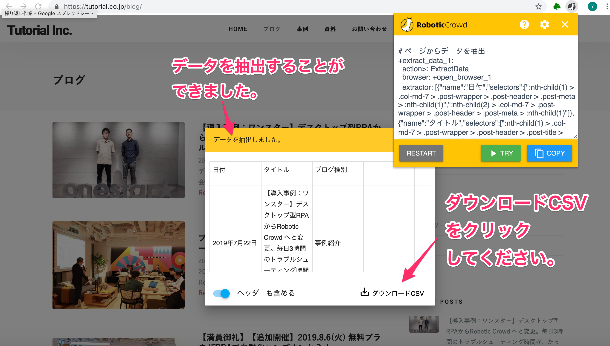

抽出したデータをCSVにダウンロードすることができました。

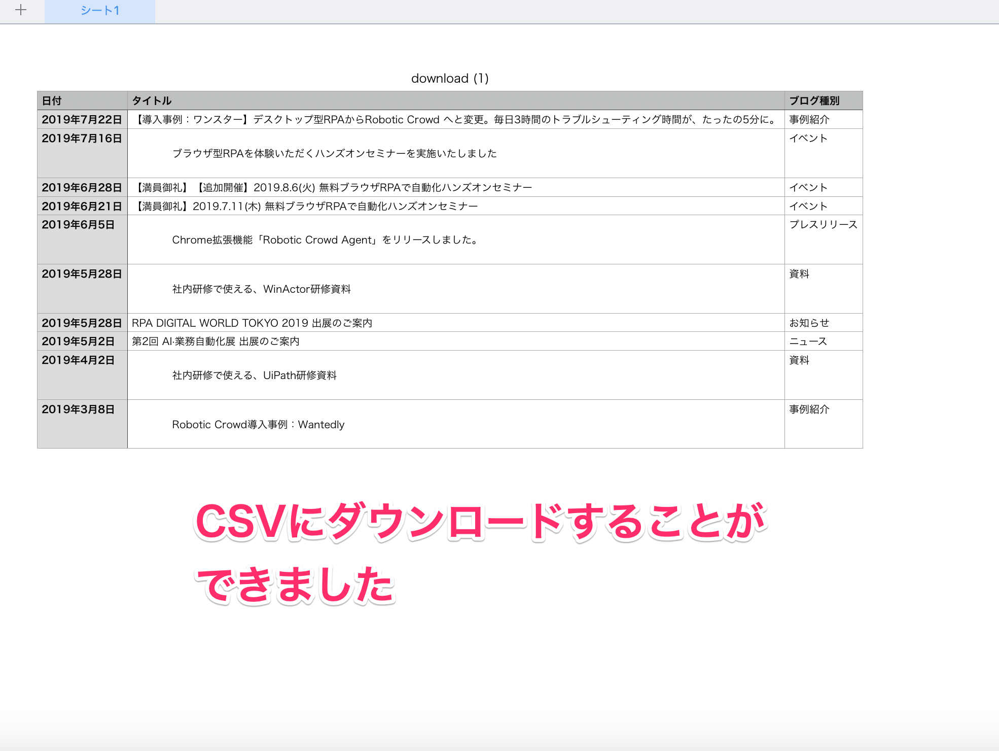  

今回の説明はここで終了です。

お疲れ様でした。

Robotic Crowd Agent で既存のワークフローを実行する方法について説明しました。この方法で、同じワークフローを何回も作成する必要が無くなりますので非常に便利かと思います。他のアクションも試して使ってみてください。