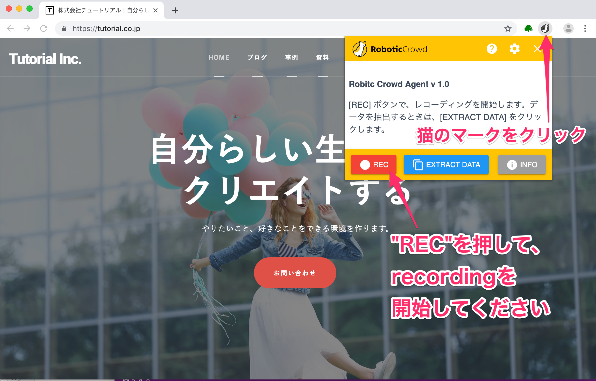

# 連続した操作を記録する（レコーディング）

## 概要  

Robotic Crowd Agentを使って、ウェブサイトを操作し、その操作を自動的に記録する方法を説明します。

事前に、Chrome に Robotic Crowd Agent という拡張機能をインストールしている必要があります。
インストール方法は、こちらをご覧ください。

では、始めましょう。  

### このチュートリアルのゴール

今回は株式会社チュートリアルのホームページの  トップページから製品サイト、製品サイトからヘルプセンター、  
ヘルプセンターに入って「RPA」と検索するところまで記録してみます。

### 作業

1. レコーディングを開始するサイトを開く
1. Robotic Crowd Agent のポップアップを表示して、RECボタンでレコーディングを開始する
1. ブラウザでいつも通りに操作する
1. STOPボタンでレコーディングを停止する
1. 記録された操作をPLAYボタンで確認する

### 1. レコーディングを開始するサイトを開く

はじめに、株式会社チュートリアル（https://tutorial.co.jp）のホームページを開いてください。

  

### 2. Robotic Crowd Agent のポップアップを表示して、RECボタンでレコーディングを開始する

Chrome のアドレスバー右側にある、猫のマークをクリックしてください。
すると、下図のように、ポップアップが表示されます。

ここで、「REC」という赤いボタンをクリックします。この状態で、上に● recordingと表示されたと思います。この状態が、レコーディングモードです。ここから操作の自動記録が開始します。

 

### 3. ブラウザでいつも通りに操作する

まず、株式会社チュートリアルのホームページからヘルプセンターに移動してみます。

下にスクロールしていくと、「製品サイトで詳細を見る」ボタンがあります。そこにカーソルを合わせて、クリックしてください。

  

クリックすると、レコーディングモードの時だけ表示されるアクション一覧が出てきます。この状態では、まだ実際にクリックしていない状態です。アクション一覧の中の「クリック」を選択してください。

すると、実際に画面が遷移するのが確認できると思います。アクション一覧の中のアクションを選択した時点で実際に操作が行われ操作が記録される仕組みになっています。

  

すると、画面が遷移して製品サイトに移りました。  
次はヘルプセンターに移動します。ページ右上の「サポート」をクリックするとアクション一覧が表示されます。  
その中の「クリック」を選択してください。  

  

クリックというアクションを押すと、ヘルプセンターのページに遷移します。  

 

###  ヘルプセンターで「RPA」と入力し、検索する

ヘルプセンターのサイトに移動することができましたら、  
回答を検索する...というところをクリックしてください。クリックすると、Text...という文字を入力できるものが出てきます。  
今回は「RPA」という言葉を検索してみます。「RPA」と入力してOKを押してください。

 

OKを押すと、RPAと入力されていることがわかります。  
検索するために、虫眼鏡のマークをクリックしてください。  
すると、アクション一覧が表示されるので「クリック」を選択してください。

 

「RPA」の検索結果が表示されました。

 

操作はここまでで終了です。記録したものを確認していきましょう。

###  recordingをstopし、記録されているか確認する  

猫のマークを押したならば、"STOP"を押してください。  
recordingが終了します。  

これまでの操作が連続して記録されていることがわかります。  
記録できていることを確認しましょう。
"RESTART","PLAY","COPY"の3種類があります。  
その中の"COPY"をクリックしてください。  
クリックしても画面上は変化はありませんが、コピーできています。 

   

テキストエディタやメモ帳などにペーストして確認してみます。  
ペーストすると操作が記録できていることがわかります。  

(「Robotic Crowd Agentで既存のワークフローを実行する」という記事の際に使用しますので、テキストエディタ等に保存しておくと便利です。)  

今回の連続した操作が記録されていることがわかります。  
また、"PLAY"を押して実際に動くことを試してみてください。 

連続した操作の記録の説明はこれで終了となります。  

今回記録されたワークフローは「Robotic Crowd Agentで既存のワークフローを実行する」という記事の際に使用しますので、テキストエディタ等に保存しておくと便利です。  