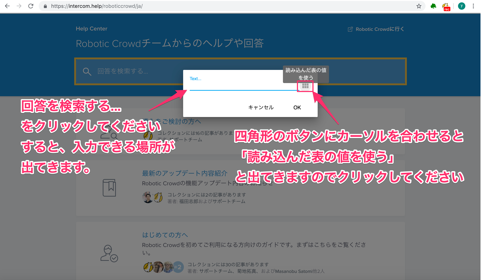

# Robotic Crowd Agentで繰り返し作業を記録する

## 概要

Robotic Crowd Agent を使って、繰り返し作業を記録する方法を説明します。

事前に、Chrome に Robotic Crowd Agent という拡張機能をインストールしている必要があります。
インストール方法は、[こちら](/robotic-crowd-agent/install-agent) をご覧ください。

では、始めましょう。

### このチュートリアルのゴール

今回は、スプレッドシートを事前に準備してから作成します。
弊社サイトのヘルプセンターで3つの単語を調べて、それぞれ検索結果がもっとも上に出てきた記事のタイトルを取得します。

### 作業

手順  

1. スプレッドシートを準備する
1. レコーディングを開始するサイトを開く
1. Robotic Crowd Agent のポップアップを表示して、RECボタンでレコーディングを開始する
1. ブラウザで操作する
1. スプレッドシート に反映されていることを確認する

### 1. スプレッドシートを準備する

スプレッドシートを準備します。
「検索文字」と「タイトル」というヘッダーを準備してください。今回は検索文字に「RPA」「CSS」「繰り返し」の3つを設定します。

### 2. レコーディングを開始するサイトを開く

株式会社チュートリアルのヘルプページ(https://intercom.help/roboticcrowd/ja/)を開いてください。

### 3. Robotic Crowd Agent のポップアップを表示して、RECボタンでレコーディングを開始する

この画面で、右上の猫のマークをクリックして起動してください。ポップアップが表示されますので「REC」ボタンをクリックしてrecordingを開始してください。

  

### 4. ブラウザで操作する

recordingを開始しましたら、ページ左上の何もない場所をクリックしてください。(ページ左上にする理由はアクション一覧が見やすいからです。)

クリックすると、アクション一覧が表示されます。アクション一覧の中の「繰り返す」を選択してください。

「繰り返す」というアクションを選択すると「繰り返しデータの登録」という画面がでてきます。CSVとSPREADSHEETの2つがありますが、今回使用するSPREADSHEETの方を選択してください。
選択すると、「スプレッドシートのURLをセットしてください」と出てきますので先ほど作成した スプレッドシートのURLを貼り付けてください。

貼り付けましたら、URLの横にダウンロードボタンが表示されますので スプレッドシートを読み込ませてください。

  

スプレッドシートを読み込ませると、下図の画面が出てきます。繰り返しに使うデータをセットします。

ここで行う作業は、繰り返しに必要のないデータを取り除く作業です。
セルの部分にカーソルを合わせると、「この行の値を削除する」という文字が出てきます。
今回の作業で「繰り返し」に必要のない部分は、ヘッダー部分の「検索文字」と「タイトル」です。したがって、一番上の行にカーソルを合わせてクリックしてください。
クリックできましたら、OKを押してください。  

  

OKボタンを押すと、元のヘルプページの画面に戻ってきます。

ページ内の「回答を検索する...」をクリックしてください。「Text...」という文字入力できる部分が出てきます。「Text...」の右にある、四角形のマークにカーソルを合わせると「読み込んだ表の値を使う」と出てきますので、クリックしてください。

  

クリックすると、下のような画面が出てきます。ここでは、繰り返しに使用したい部分を選択します。検索文字の欄にカーソルを合わせると「この列を使用する」と出てきますので、クリックしてください。クリックすると、ヘルプセンターの画面に戻ります。

  

ヘルプセンターの画面に戻ると検索文字の最初の「RPA」が入力されていることが分かります。

次に、検索するために虫眼鏡のマークをクリックしてください。
アクション一覧が表示されますので、「クリック」を選択してください。

虫眼鏡マークの部分のみをクリックしてください。虫眼鏡マーク周辺をクリックしてしまうと、うまく動かない場合があります。

  

「クリック」を選択すると自動的にページが遷移し、検索結果が表示されます。
「RPA」と検索して表示された、一番上の記事のタイトルを取得します。
タイトルの部分をクリックしてください。アクション一覧が表示されますので、「テキストを取得」を選択してください。

記事のタイトル部分のみをクリックしてください。タイトル周辺をクリックすると、記事のタイトルがうまく取得できない場合があります。

「テキストを取得」を選択すると元の、RPAと検索した画面に戻りますが、再び一番上の記事のタイトル部分をクリックしてください。

アクション一覧が表示されますので、その中の「スプレッドシートのセルの値を更新」を選択してください。  

「スプレッドシートのセルの値を更新」を選択すると、下のような画面が出てきます。  
作成した スプレッドシートのURLをセットしてください。
URLをセットしましたら、右に出てくるダウンロードボタンをクリックしてください。

URLをセットして、ダウンロードボタンをクリックすると下図の画面が出てきます。
Valuesの中身を取得しましょう。Valuesの右にあるボタンをクリックしてください。

  

下図の画面が出てきます。
取得したい記事のタイトルと同じものがリスト内のOutputの欄に出てきますので、その部分をクリックしてください。

  

クリックすると、Valuesの部分が自動的に入力されます。

次はRangeを入力します。
Rangeの右にある四角形のボタンをクリックしてください。

「値を入力する範囲」、つまりここでは「記事のタイトルを入力したい範囲」を設定していきます。
「RPA」と検索した隣のセルに「RPAと検索して出てきた一番上の記事のタイトル」を入力したいので、RPAの右隣のセルをクリックしてください。

クリックすると、ValuesとRangeが入力されます。入力できていることを確認しましたら、OKを押してください。

操作はここまでで終了です。

### 5. スプレッドシート に反映されていることを確認する

recordingを終了させましょう。
猫のマークをクリックして「STOP」を押してください。

「PLAY」をクリックして、実際に動かしてみます。

ロボットが動き、検索していることが分かります。
最後に スプレッドシートを確認してみましょう。
スプレッドシートのタイトル欄に記事のタイトルが入力されています。

今回は、繰り返し作業を記録する方法を解説しました。  

お疲れ様でした。

同じ作業を何度も繰り返すのは大変ですが、繰り返すアクションを使うと楽になります。次は既存のワークフローを実行する方法を解説します。一度作成したワークフローを実行したい時に、再度recordingする必要が無くなります。
