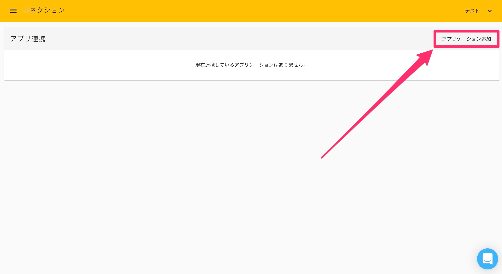
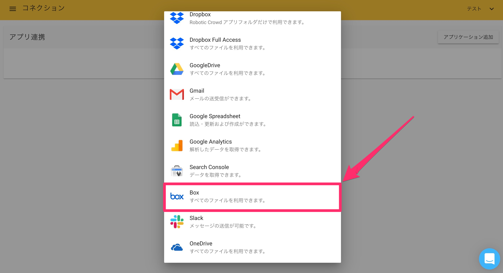
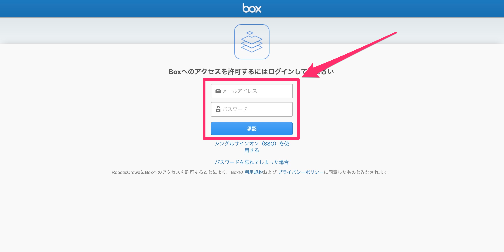
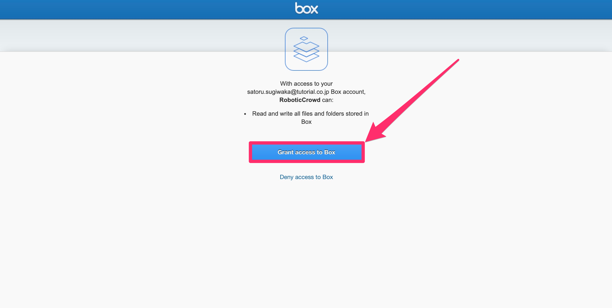
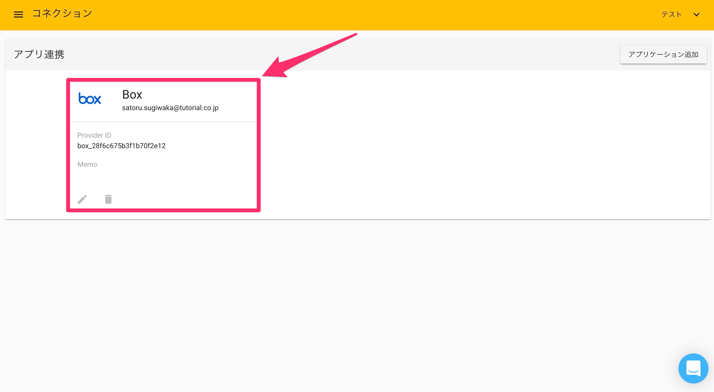

# box

### 概要

Robotic Crowdでは、Box APIと連携する事で、「SaveFile」と「GetFile」アクションで、Boxからのファイル取得やBoxへのファイル保存が可能になります。

###  Boxとのコネクション作成

最初にRobotic Crowdの左側のサイドバーの「コネクション」をクリックします。

「コネクション」をクリックすると、APIとのコネクション一覧画面に移動します。右上の「アプリケーションを追加」をクリックします。

右上の「アプリケーション追加」をクリックすると連携可能なアプリケーションのリストが表示されるので、その中から「Box」を選択します。

「Box」をクリックすると、Boxへのログイン画面が表示されます。コネクションに利用するアカウントを入力してください。

ログインすると「Robotic Crowd」はユーザー様の代わりに、ユーザー様のBoxアカウントで管理している全てのフォルダとファイルに対する読み書きを行う権限を要求します。このアクセス権限を「Robotic Crowd」に与える事に、同意した上で「許可」をクリックしてください。

「許可」をクリックするとRobotic Crowdのコネクション画面にリダイレクトされます。「Box」とのコネクションが作成されていれば成功です。

