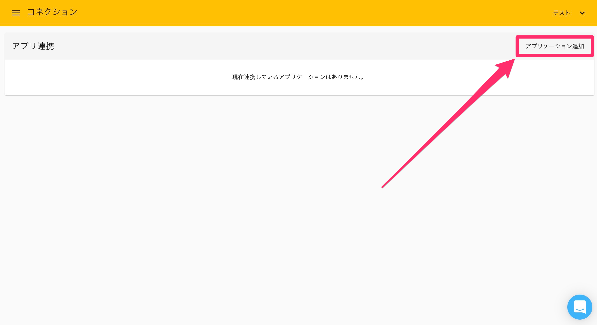

# Dropbox

## 概要

Robotic Crowdでは、Dropbox APIと連携する事で「SaveFile」と「GetFile」アクションにおいて、Dropboxからのファイル取得やDropboxへのファイル保存が可能になります。 Dropbox APIとの連携においては、ユーザー様が管理する全てのファイルにアクセスできる権限をもつ「Robotic Crowd」と連携する「Dropbox Full Access」と、アプリフォルダ内の「Robotic Crowd」のみにアクセス出来る「Robotic Crowd」と連携する「Dropbox」の二つのコネクションを選択できます。

## Dropboxとのコネクション作成

最初にRobotic Crowdの左側のサイドバーの「コネクション」をクリックします。

「コネクション」をクリックすると、APIとのコネクション一覧画面に移動します。右上の「アプリケーションを追加」をクリックします。

右上の「アプリケーション追加」をクリックすると連携可能なアプリケーションのリストが表示されるので、その中から「Dropbox」を選択します。

「Dropbox」をクリックすると、Dropboxへのログイン画面が表示されます。Googleアカウントでログインするか、Dropboxアカウントでログインするか選択してください。

アカウントを選択すると「Robotic Crowd」は、ユーザー様のdropboxアカウントのアプリフォルダ内に作成される「Robotic Crowd」のみ読み書きを行うアクセス権限を要求します。このアクセス権限を「Robotic Crowd」に与える事に同意した上で「許可」をクリックしてください。

「許可」をクリックすると、Robotic Crowdのコネクション画面にリダイレクトされます。「Dropbox」とのコネクションが作成されていれば成功です。

## Dropbox Full Accessとのコネクション作成

最初にRobotic Crowdの左側のサイドバーの「コネクション」をクリックします。

「コネクション」をクリックすると、APIとのコネクション一覧画面に移動します。右上の「アプリケーションを追加」をクリックします。

右上の「アプリケーション追加」をクリックすると連携可能なアプリケーションのリストが表示されるので、その中から「Dropbox Full Access」を選択します。

「Dropbox Full Access」をクリックすると、Dropboxへのログイン画面が表示されます。コネクションに利用するアカウントを選択してください。

アカウントを選択すると、「Robotic Crowd」はユーザー様の代わりに、ユーザー様のdropboxアカウントで管理している全てのフォルダとファイルに対して読み書きを行う権限を要求します。 このアクセス権限を「Robotic Crowd」に与える事に、同意した上で「許可」をクリックしてください。

「許可」をクリックするとRobotic Crowdのコネクション画面にリダイレクトされます。「Dropbox Full Access」とのコネクションが作成されていれば成功です。

