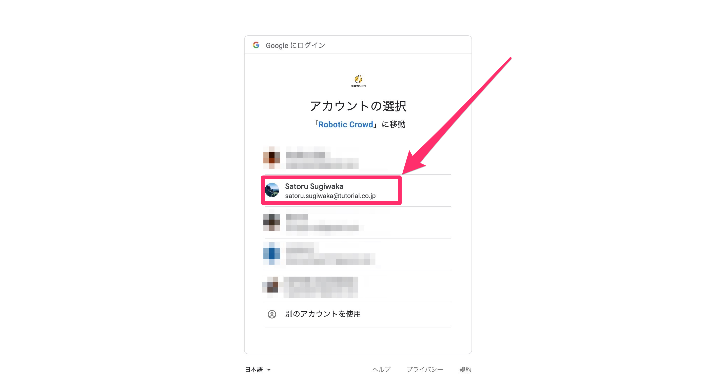

# Gmail

### 概要

Robotic Crowdでは、Gmail APIと連携する事で、自分のアカウントから自動でメールを送信したり、任意のメール取得が可能になります。

###  Gmail APIとのコネクション作成

最初にRobotic Crowdの左側のサイドバーの「コネクション」をクリックします。

「コネクション」をクリックすると、APIとのコネクション一覧画面に移動します。右上の「アプリケーションを追加」をクリックします。

右上の「アプリケーション追加」をクリックすると連携可能なアプリケーションのリストが表示されるので、その中から「Gmail」を選択します。

「Gmail」をクリックすると、ユーザー様が持つGmailのアカウント選択画面が表示されます。コネクションに利用するアカウントを選択してください。

アカウントを選択すると、「Robotic Crowd」がユーザー様に変わって実行する処理に対して権限を与える画面が表示されます。「許可」をクリックしてください。

「許可」をクリックすると、Robotic Crowdのコネクション画面に戻り、「Gmail」とのコネクションが作成されます。これでGmailSendアクション(Gメールを送信)とGmailGetアクション(Gメールを取得)が利用可能になります。

