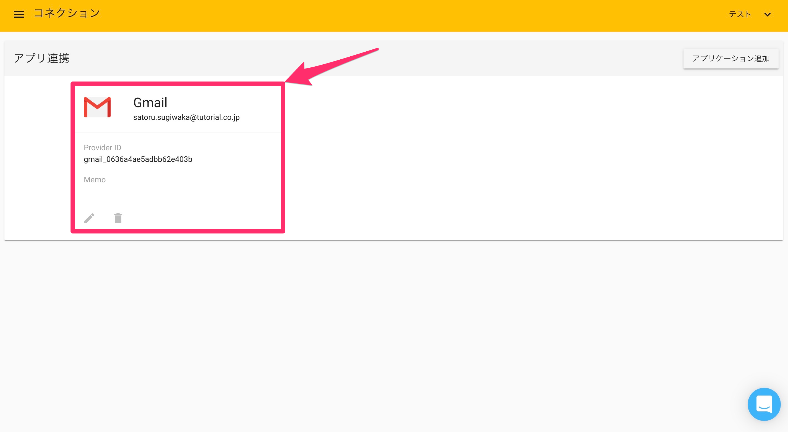

# Gmail

### 概要

Robotic Crowdでは、Gmail APIと連携する事で、ユーザー様の代わりに自動でメールを送信する「GmailSendアクション」と任意のメールを取得する「GmailGetアクション」が利用可能になります。

###  Gmailとのコネクション作成

最初にRobotic Crowdの左側のサイドバーの「コネクション」をクリックします。

「コネクション」をクリックすると、APIとのコネクション一覧画面に移動します。右上の「アプリケーションを追加」をクリックします。

右上の「アプリケーション追加」をクリックすると連携可能なアプリケーションのリストが表示されるので、その中から「Gmail」を選択します。

「Gmail」をクリックすると、ユーザー様が持つGoogleアカウント選択画面が表示されます。コネクションに利用するアカウントを選択してください。

アカウントを選択すると「Robotic Crowd」はユーザー様の代わりに「ユーザーのアカウントからメールメッセージおよびラベルを表示/検索する権限」と「ユーザーとしてメールを送信する権限」を要求します。上記の二つのアクセス権限を「Robotic Crowd」に与える事に、同意した上で「許可」をクリックしてください。

「許可」をクリックすると、Robotic Crowdのコネクション画面にリダイレクトされます。「Gmail」とのコネクションが作成されていれば成功です。

