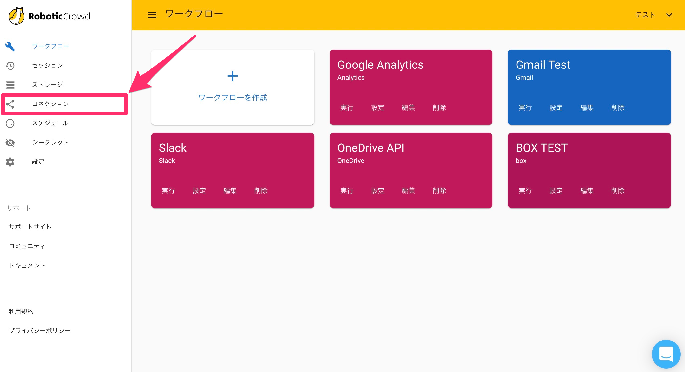
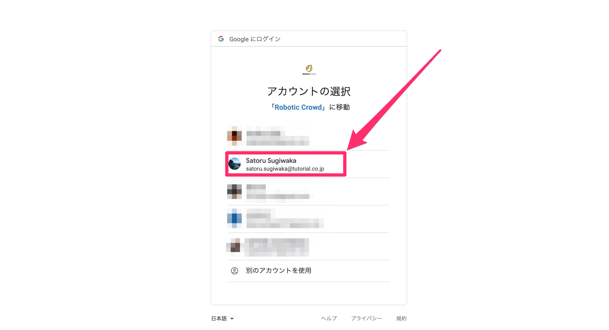

# Google Analytics

## 概要

Robotic Crowdでは、Google Analytics APIと連携する事で、Google広告からレポートを取得するアクション\(GetGoogleAdsReport\)が利用可能になります。

## Google Analyticsとのコネクション作成

最初にRobotic Crowdの左側のサイドバーの「コネクション」をクリックします。

「コネクション」をクリックすると、APIとのコネクション一覧画面に移動します。右上の「アプリケーションを追加」をクリックします。

右上の「アプリケーション追加」をクリックすると連携可能なアプリケーションのリストが表示されるので、その中から「Google Analytics」を選択します。

「Google Analytics」をクリックすると、ユーザー様が持つGoogleアカウント選択画面が表示されます。コネクションに利用するアカウントを選択してください。

アカウントを選択すると、「Robotic Crowd」がユーザー様に変わって実行する処理に対して権限を与える画面が表示されます。 「Googleアナリティクスデータの表示」という項目では、「Robotic Crowd」はユーザーの代わりに、ユーザーのAnalyticsアカウントのリソースを読み取る権限を要求します。 アクセス権限を「Robotic Crowd」に与える事に同意した上で「許可」をクリックしてください。

「許可」をクリックすると、Robotic Crowdのコネクション画面にリダイレクトされます。「Google Analytics」とのコネクションが作成されていれば成功です。

