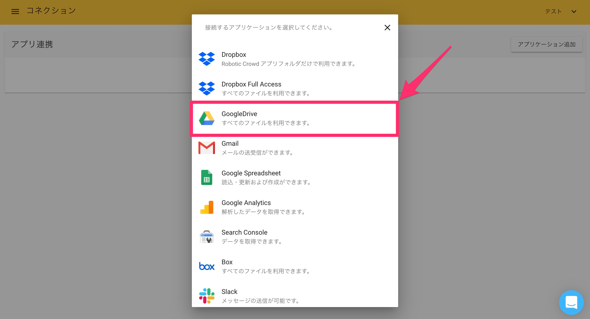
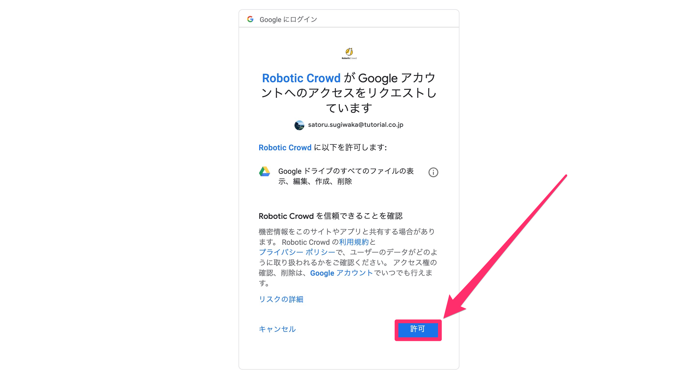
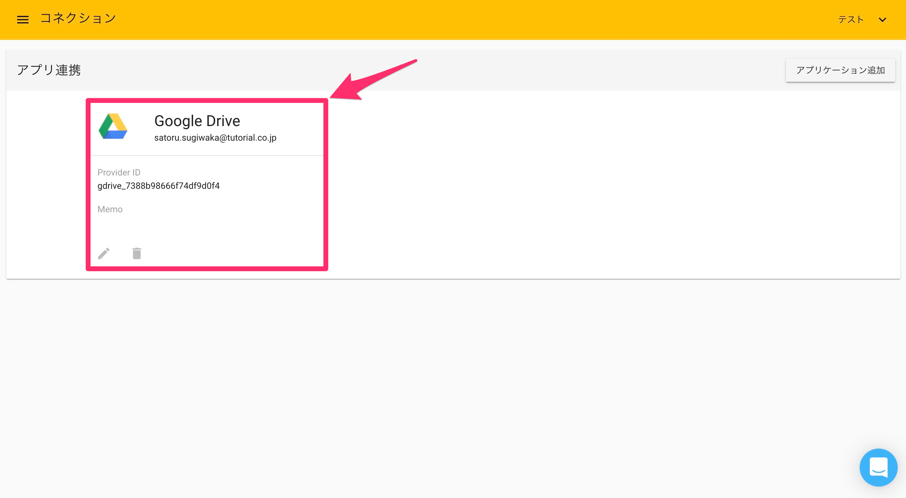

# Google Drive

## 概要

Robotic Crowdでは、Google Drive APIと連携する事で「SaveFile」と「GetFile」アクションにおいてGoogle Driveからファイルの取得やアップロード、削除などの操作が可能になります。

## Google Driveとのコネクション作成

最初にRobotic Crowdの左側のサイドバーの「コネクション」をクリックします。

「コネクション」をクリックすると、APIとのコネクション一覧画面に移動します。右上の「アプリケーションを追加」をクリックします。

右上の「アプリケーション追加」をクリックすると連携可能なアプリケーションのリストが表示されるので、その中から「Google Drive」を選択します。

「Google Drive」をクリックすると、ユーザー様が持つGoogleアカウント選択画面が表示されます。コネクションに利用するアカウントを選択してください。

アカウントを選択すると、「Robotic Crowd」がユーザー様に変わって実行する処理に対して権限を与える画面が表示されます。 「Google ドライブのすべてのファイルの表示、編集、作成、削除」という項目では、「Robotic Crowd」はユーザーの代わりに、下記の操作を行う権限を要求します。

-ファイルの表示

-ファイルのアップロード、ダウンロード

-ファイルの削除

-ファイルの共有先の名前、メールアドレスの表示

-他のユーザーとのファイルの共有、共有の停止

-ファイルからのユーザーの削除

-ドライブの整理

（注）Google ドライブには、財務記録、医療レポート、写真、税務情報など、個人情報が含まれている場合があります。

アクセス権限を「Robotic Crowd」に与える事に同意した上で「許可」をクリックしてください。

「許可」をクリックすると、Robotic Crowdのコネクション画面にリダイレクトされます。「Google Drive」とのコネクションが作成されていれば成功です。

