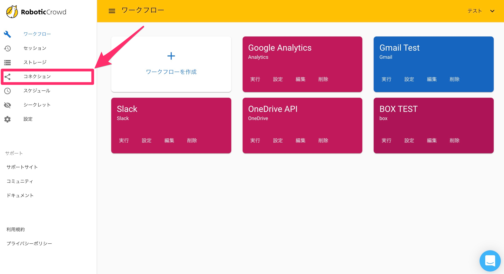
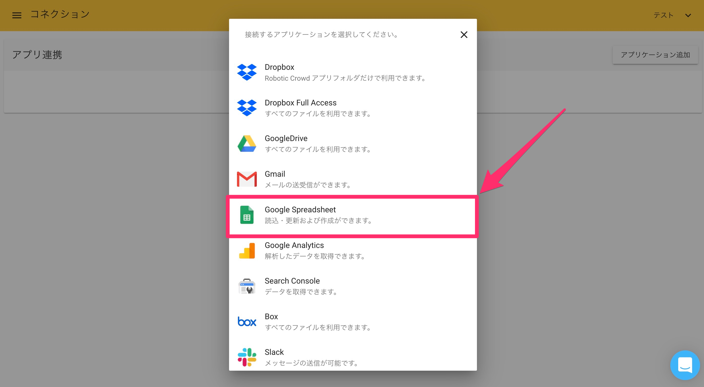
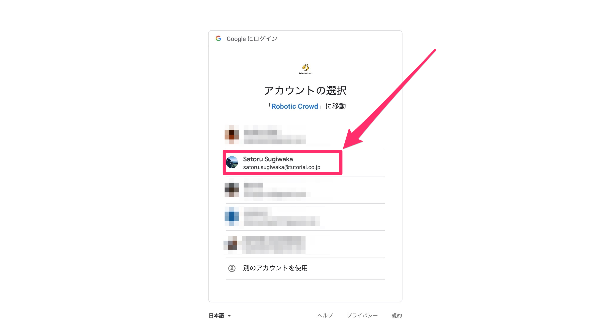
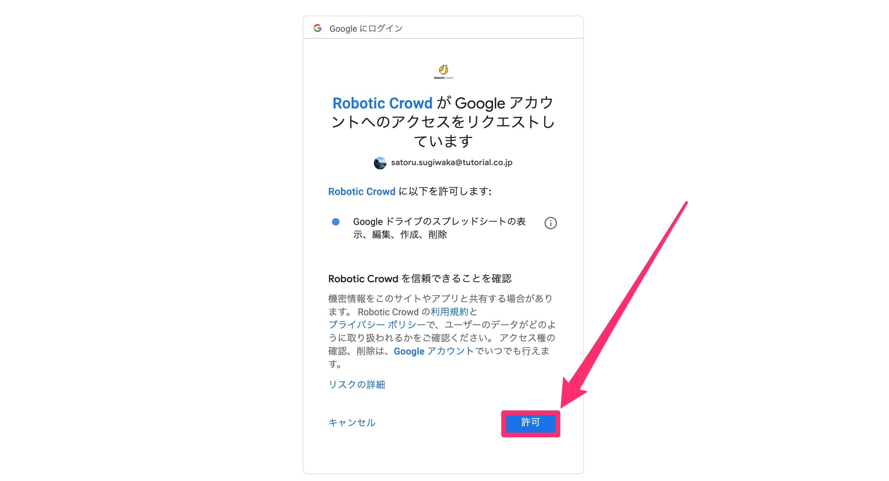
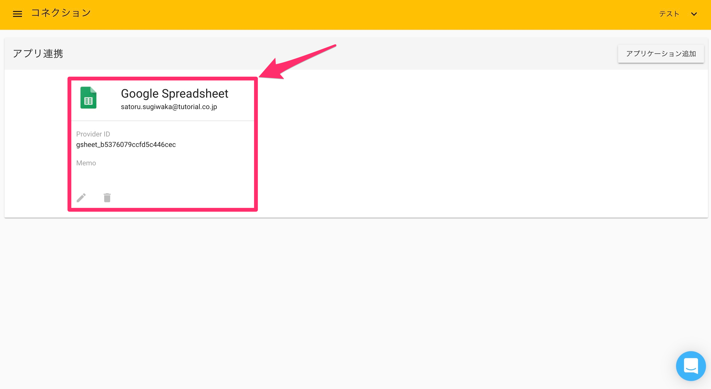

# Google Spreadsheet

## 概要

Robotic Crowdでは、Google Spreadsheet APIと連携する事で、スプレッドシートを新たに作成したりCreateSpreadsheet\)、セルを操作できるアクション\(UpdateCells\)が利用可能になります。

## Google Spreadsheetとのコネクション作成

最初にRobotic Crowdの左側のサイドバーの「コネクション」をクリックします。

「コネクション」をクリックすると、APIとのコネクション一覧画面に移動します。右上の「アプリケーションを追加」をクリックします。

右上の「アプリケーション追加」をクリックすると連携可能なアプリケーションのリストが表示されるので、その中から「Google Spreadsheet」を選択します。

「Google Spreadsheet」をクリックすると、ユーザー様が持つGoogleアカウント選択画面が表示されます。コネクションに利用するアカウントを選択してください。

アカウントを選択すると、「Robotic Crowd」がユーザー様に変わって実行する処理に対して権限を与える画面が表示されます。 「Robotic Crowd」はユーザーの代わりに、下記の操作を行う権限を要求します。

-スプレッドシートの表示

-スプレッドシートの編集

-スプレッドシートの新規作成

-スプレッドシートのアップロードやダウンロード

-スプレッドシートの整理と削除

-スプレッドシートを共有しているユーザーの表示と変更

（注）スプレッドシートには、財務記録や個人的リストなどの機密情報が含まれている可能性があります。

アクセス権限を「Robotic Crowd」に与える事に同意した上で「許可」をクリックしてください。

「許可」をクリックすると、Robotic Crowdのコネクション画面にリダイレクトされます。「Google Spreadsheet」とのコネクションが作成されていれば成功です。 

