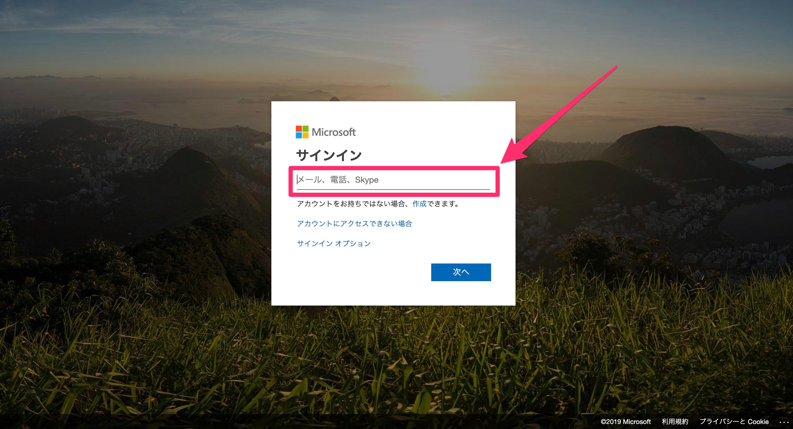

# OneDrive

### 概要

Robotic Crowdでは、OneDrive APIと連携する事で、「SaveFile」と「GetFile」アクションでOneDriveからのファイルの取得やファイルの保存が可能になります。

###  OneDriveとのコネクション作成

最初にRobotic Crowdの左側のサイドバーの「コネクション」をクリックします。

「コネクション」をクリックすると、APIとのコネクション一覧画面に移動します。右上の「アプリケーションを追加」をクリックします。

右上の「アプリケーション追加」をクリックすると連携可能なアプリケーションのリストが表示されるので、その中から「OneDrive」を選択します。

「OneDrive」をクリックすると、OneDriveへのログイン画面が表示されます。コネクションに利用するアカウントを選択してください。

アカウントを選択すると「Robotic Crowd」はユーザー様の代わりに、ユーザー様のOneDriveアカウントに格納されているすべてのファイルとフォルダに対する読み書きを行う権限を要求します。上記のアクセス権限を「Robotic Crowd」に与える事に、同意した上で「許可」をクリックしてください。

「許可」をクリックすると、Robotic Crowdのコネクション画面に戻ります。「OneDrive」とのコネクションが作成されていれば成功です。

