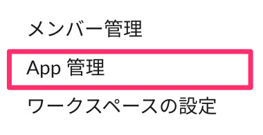
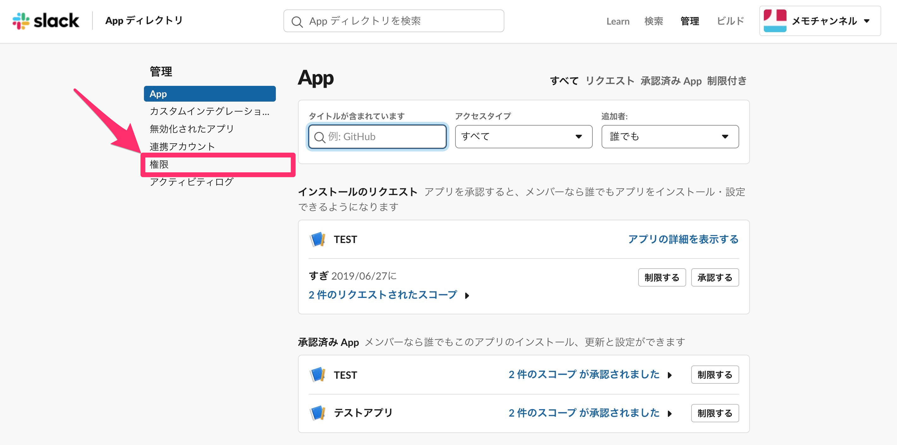
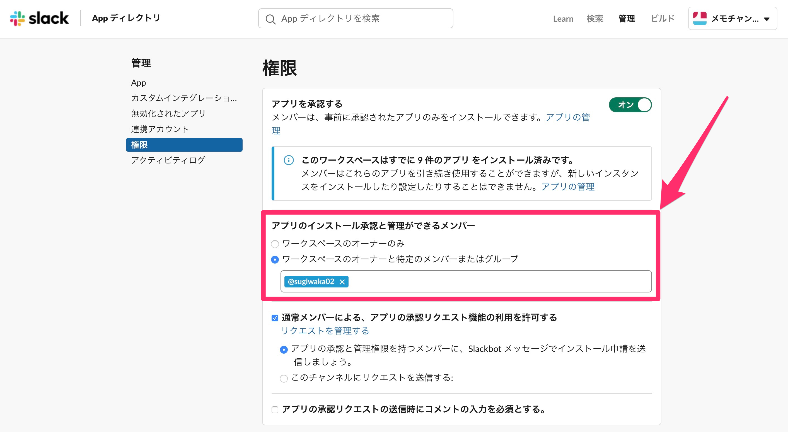

# Slack

### 概要

Robotic Crowdでは、Slackと連携させる事により、アクション内でロボット\(bot\)からの自動メッセージ送信(SendSlackMessage)が可能になります。 Slackアクションを使用する為に、事前にSlack APIでアプリを作成し幾つか設定をしておく必要があります。

要確認）Robotic Crowd では、ユーザー様のワークスペース内の Slack アプリとして連携します。アプリの作成・Robotic Crowdへのインストールの前にワークスペース管理者に連携する旨を連絡し承諾を得ておいてください。

<!-- ### ユーザー権限

Slackでは「オーナー/管理者/メンバー/ゲスト」のいずれかの権限が、ワークスペース内に参加している各ユーザーに与えられます。「オーナー」権限を持つユーザーは、ワークスペースへのアプリインストールを承認制に設定する事が可能です。

参加するワークスペースでインストール制限が設定されている状況で、「管理者」もしくは「メンバー」のユーザーがアプリを作成しコネクション連携を行う場合は、「オーナー」権限を持つユーザーがSlackの権限設定ページ内の「アプリのインストール承認と管理ができるメンバー」項目で、任意のユーザーに権限を付与する必要があります。

設定方法については、次の「アプリのインストール制限」の項目を参考にしてください。また次の条件に当てはまる場合は、「アプリのインストール制限」の設定は必要ありません。

1.アプリ作成者が「オーナー」権限を持つユーザーであった場合

2.参加しているワークスペースでアプリのインストール制限を設定していない場合 -->

<!-- ### アプリのインストール制限

（注）この項目での設定はワークスペースで「オーナー」権限を持つユーザーのみ可能です。

ワークスペースで左上のワークスペース名の横にある矢印部分をクリック、設定ダイアログが開くので「その他管理項目」から「APP管理」をクリックします。

ワークスペースにおけるアプリの管理画面が開くので、「権限」をクリックします。

「アプリのインストール承認と管理ができるメンバー」の項目で、ユーザーを追加します。

追加されたユーザーは、作成したアプリとコネクション連携を行う際にオーナーにリクエストを送る事なく、アプリをワークスペースにインストールする事が出来ます。 -->

### Slack APPの作成

最初に、次のリンクからSlack APPを作成します。[https://api.slack.com/](https://api.slack.com/)

右上の「Your Apps」をクリックすると、アプリ作成画面に遷移します。

アプリ作成画面から「Create New App」をクリックします。

表示されたダイアログの「App Name」にアプリの名前、「Development Slack Workspace」に、使用したいワークスペースを選択してください。

### Client IDとClient Secretの取得

アプリを作成すると「Basic Information」が表示され、その中に、「App Credentials」と言うセクションがあります。その中の、「Client ID」と「Client Secret」を Robotic CrowdでSlackコネクションを追加する際に使用します。

### Redirect URLsの設定

次に、「OAuth & Permissions」の項目をクリックし、「Redirect URLs」の箇所に下記のURLを入力してください。 [https://console.roboticcrowd.com/connections/slack/callback](https://console.roboticcrowd.com/connections/slack/callback)

## Robotic Crowdでのコネクション連携

Slack APIでの設定が完了した後は、Robotic Crowdでコネクション連携を行います。コネクション追加画面でSlackを選択します。

表示されるダイアログに、設定した「Client ID」と「Client Secret」を入力します。

「Client ID」と「Client Secret」を入力すると、Slack APPの認証画面が表示されるのでインストールをクリックしてください。

ここで、管理者権限が無い場合は、ワークスペース管理者に「Slackbot」からアプリのインストールの通知が送られていると思います。ワークスペース管理者に確認の上ワークスペースでの利用を承認してもらってください。

承認を得たら再度コネクションを登録し直してください。連携が追加されます。
＊事前に承認されている場合は、すぐに登録されます。

連携が成功すると Robotic Crowd のコネクションにアプリが追加されます。これでワークフロー内で、Slackに関係するアクションが使用可能になります。

