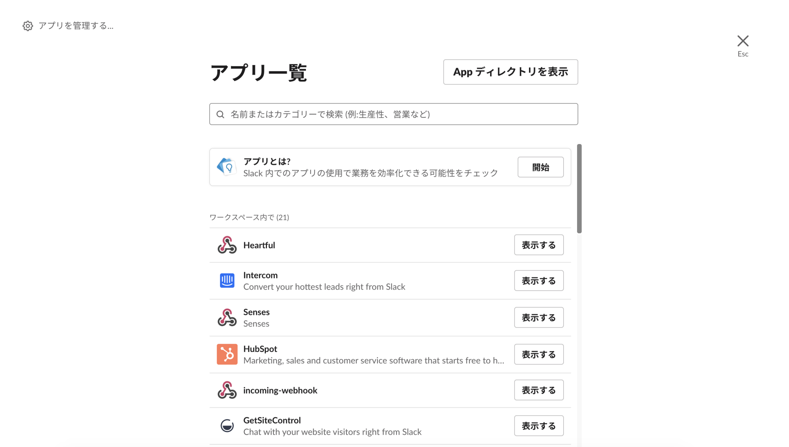

# Slack APPの設定

### 概要

Robotic Crowdでは、Slackと連携させる事により、Slackを用いたアクションでロボット(bot)に自動でメッセージを送信させたり、エラーをSlackに通知させる事が出来ます。
実際に、Robotic CrowdでSlack関連の機能を使用する為には、任意のSlackワークスペースにアプリをインテグレーションしておく必要があります。

### アプリのインテグレーション

アプリをインストールする方法は、Slack APPディレクトリからアプリをインストールする方法と、Slack内でアプリを追加する方法の2パターンあります。

### APPディレクトリからインストールする方法

Slack APPディレクトリで、「Robotic Crowd」を検索。下の画像のようなページが表示されるので、「インストール」をクリック。

```
画像追加予定(Robotic Crowdのアプリの詳細ページの画面)
```

インストールをクリックすると、下の画像のようなページが表紙されるので、「インテグレーションを追加」をクリック。

```
画像追加予定(Robotic Crowdのアプリをインテグレーションする画面)
```

### Slackワークスペースからインストールする方法

Slackにログインしたら、左下のAppの隣のプラスボタンをクリック。下の画像のようなメニューが表示されるので、その中から、「Appディレクトリを表示」を選択。
Appディレクトリに移動した後は、上の項目を参照してください。


