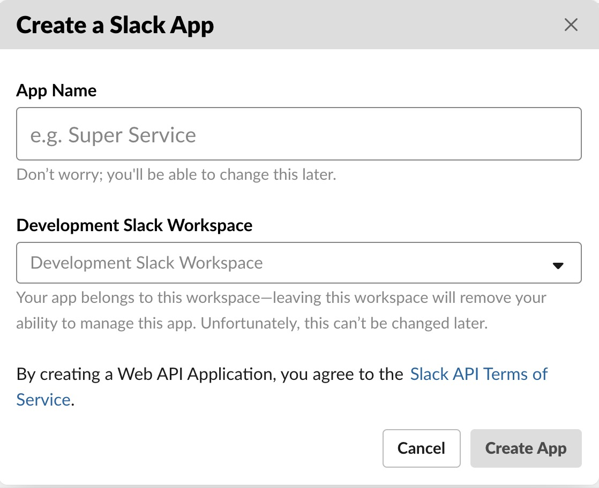
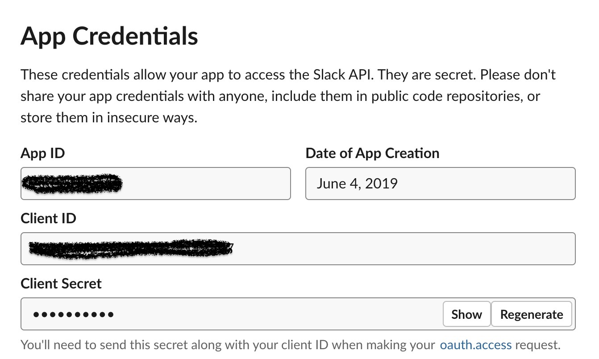
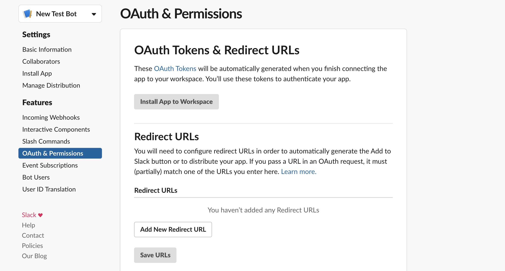
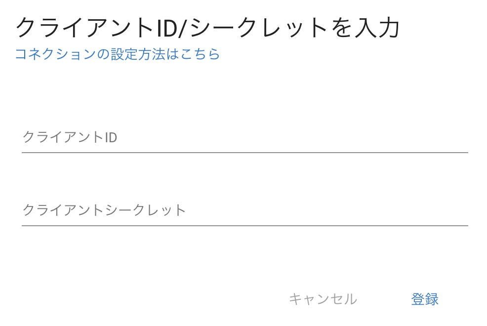

# Slack APPの設定

### 概要

Robotic Crowdでは、Slackと連携させる事により、アクション内でロボット(bot)からの自動メッセージ送信や、エラー通知が可能になります。
Slack関連の機能を使用する為に、事前にSlack APIでアプリを作成し幾つか設定をしておく必要があります。

### アプリの作成

こちらから、Slack APP作成します。→　https://api.slack.com/

右上の「your app」をクリックすると、アプリ作成画面に遷移するので、「create your app」という項目からアプリの名前と使用したいワークスペースを選択してください。

### クライアントIDとクライアントシークレットの取得

アプリを作成すると、クライアントIDとクライアントシークレットが発行されます。このクライアントIDとクライアントシークレットを、Robotic-CrowdでSlackコネクションを追加する際に使用します。

### リダイレクトURLの設定

次に、OAuth & Permissionsの項目をクリックし、Redirect URLsの箇所に下記のURLを入力してください。
http://localhost:3000/connections/slack/callback

## RoboticCrowdでのコネクション連携

Slack APIでの設定が完了した後は、RoboticCrowdでコネクション連携を行います。コネクション追加画面でSlackを選択するとダイアログが表示されるので、
設定したクライアントIDとクライアントシークレットを入力します。

