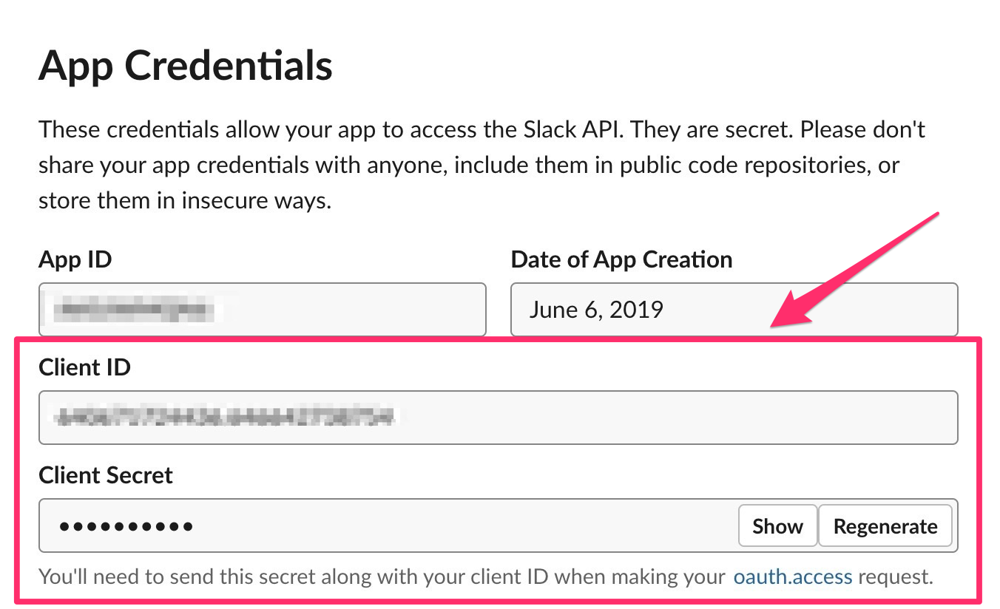

# Slack

### 概要

Robotic Crowdでは、Slackと連携させる事により、アクション内でロボット　\(bot\) からの自動メッセージ送信機能　(SendSlackMessage) が使用可能になります。 Slackアクションを使用する為に、事前にSlack APIでアプリを作成し幾つか設定をしておく必要があります。

**注意：Robotic Crowd では、ユーザー様のワークスペース内の Slack アプリとして連携します。アプリの作成と Robotic Crowd へのインストールの前にワークスペース管理者に連携する旨を連絡し承諾を得ておいてください。**

### Slack APPの作成

最初に、次のリンクからSlack APPを作成します。[https://api.slack.com/](https://api.slack.com/)

#### 右上の「Your Apps」をクリックすると、アプリ作成画面に遷移します。


#### アプリ作成画面から「Create New App」をクリックします。


### 表示されたダイアログの「App Name」にアプリの名前（好きに命名して大丈夫です。わかりやすい名前にしておきましょう）、「Development Slack Workspace」に、使用したいワークスペースを選択してください。


### Client IDとClient Secretの取得

アプリを作成すると「Basic Information」が表示され、その中に、「App Credentials」と言うセクションがあります。その中の、「Client ID」と「Client Secret」を Robotic CrowdでSlackコネクションを追加する際に使用します。



### Redirect URLsの設定

次に、「OAuth & Permissions」の項目をクリックし、「Redirect URLs」の箇所に下記のURLを入力してください。

```
https://console.roboticcrowd.com/connections/slack/callback
```


## Robotic Crowdでのコネクション連携

Slack API での設定が完了した後は、Robotic Crowd でコネクション連携を行います。コネクション追加画面で Slack を選択します。


表示されるダイアログに、設定した「Client ID」と「Client Secret」を入力します。


「Client ID」と「Client Secret」を入力すると、Slack APP の認証画面が表示されるのでインストールをクリックしてください。

### 管理者権限がない場合

ここで、管理者権限が無い場合は、次の画面が表示されるので「リクエストを送信」をクリックしてください。ワークスペース管理者に「Slackbot」からアプリのインストールの通知が送られます。ワークスペース管理者に確認の上ワークスペースでの利用を承認してもらってください。承認を得たら再度コネクションを登録しなおすと、次の「事前に承認されている場合」とのステップに進めます。


### 事前に承認されている場合

事前に承認されている場合は、次の画面が表示されるので、「インストール」をクリックしてください。


連携が成功すると Robotic Crowd のコネクションにアプリが追加されます。これでワークフロー内で、Slackに関係するアクションが使用可能になります。


