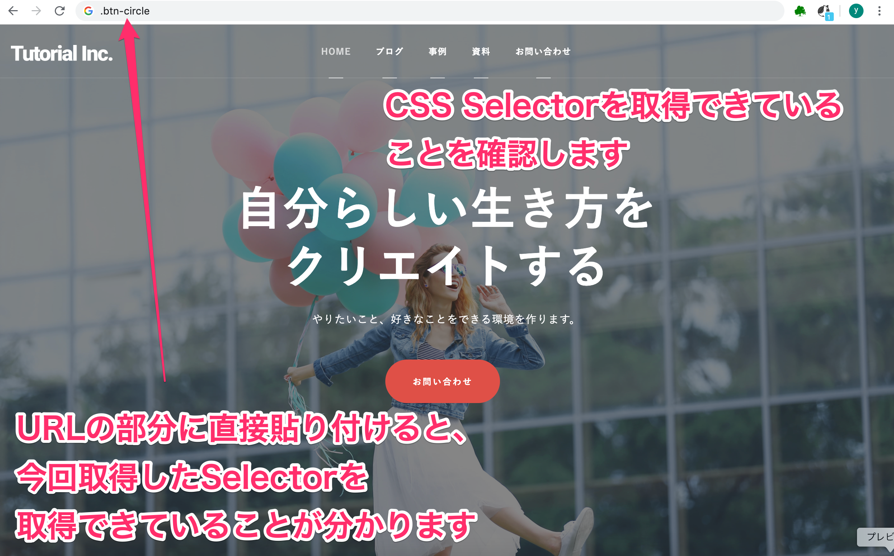

# CSSセレクタの取得

## 概要

Robotic Crowd Agentを使って、サイト上の要素の場所を特定するCSS Selector を取得する方法を説明します。

事前に、Chrome に Robotic Crowd Agent という拡張機能をインストールしている必要があります。 インストール方法は、[こちら](https://docs.roboticcrowd.com/robotic-crowd-agent/install-agent) をご覧ください。

では、始めましょう。

### このチュートリアルのゴール

今回は、株式会社チュートリアルのホームページ上のお問い合わせボタンのCSS Selector を取得してみます。

### 手順

1. 取得したい要素が表示されているページを開く
2. 取得したい要素の上で右クリックをする
3. コンテクストメニューの「CSS Selector を取得」というメニューをクリックする
4. コピーされたCSS Selector をペーストして確認する

### 1. 取得したい要素が表示されているページを開く

[Google](https://google.co.jp) で、「株式会社チュートリアル」と検索して、弊社サイトに入ってください。

### 2. 取得したい要素の上で右クリックをする

「お問い合わせ」のボタンがありますので、カーソルを合わせて右クリックをしてください。 すると図のようなコンテクストメニューが表示されます。

猫のマークが左に付いている「CSS Selectorを取得」というメニューをクリックしてください。

### 3. コンテクストメニューの「CSS Selector を取得」というメニューをクリックする

CSS Selectorを取得できると、取得した場所が約3秒間、青く囲まれます。この状態で、CSS Selector がコピーできています。 この青い囲みが目的の場所じゃない所に表示されていれば右クリックする場所を調整してもう一度、CSS Selector を取得してください。

＊青い囲みは、サイトのデザインによって、線が見えにくくなったり細くなったりすることがあります。

### 4. コピーされたCSS Selector をペーストして確認する

では、実際に、CSS Selectorを取得できていることを確認してみましょう。URLの部分にペーストしてみます。 株式会社チュートリアルのURLの部分に、そのままペーストしてください。\(メモ帳などでも構いません。\)

ペーストすると、CSS Selector が取得できていることが分かります。

お疲れ様でした。

機能拡張を使うと簡単に CSS Selector を取得できることがわかったと思います。 ですが、操作が多い時に一つ一つの CSS Selector を右クリックで取得してペーストするのは大変ですね。

次は、連続して操作を記録する方法をご紹介します。連続して操作を記録すると、普通にブラウザを操作している感覚で自動的に CSS Selector を取得していくことができます。

