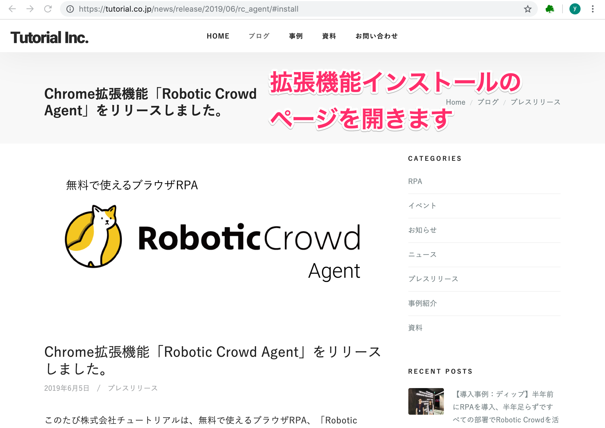
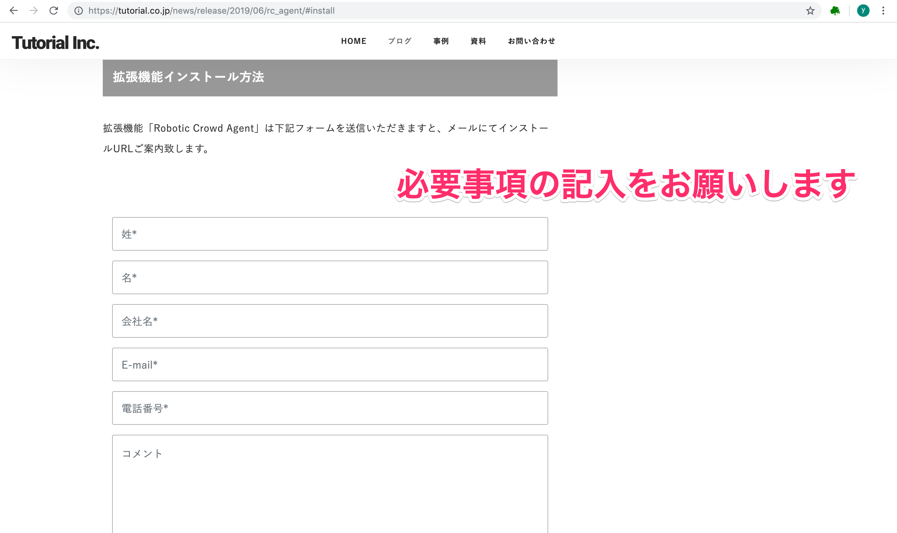
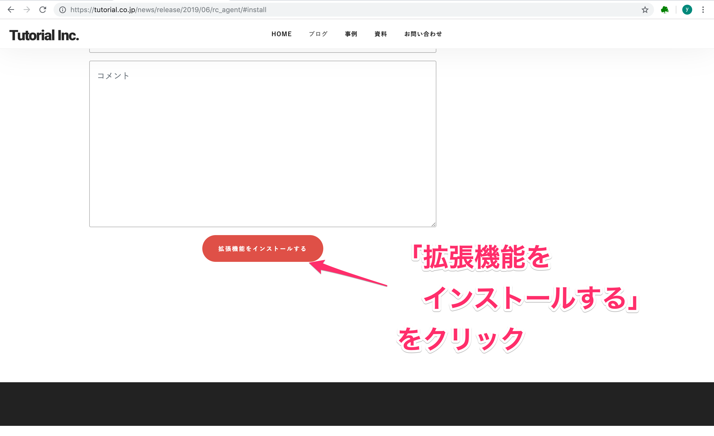
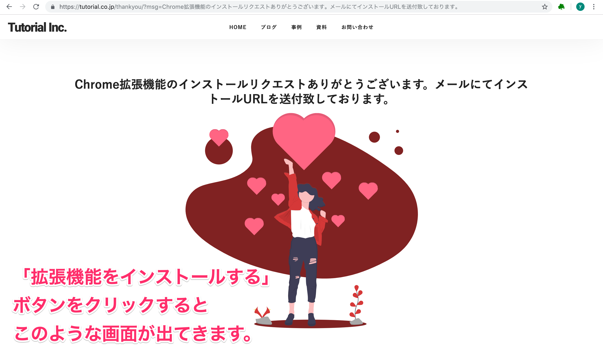
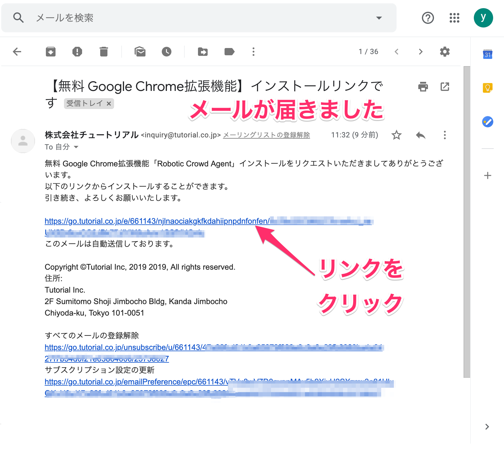
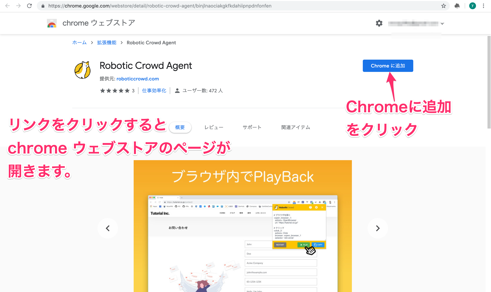
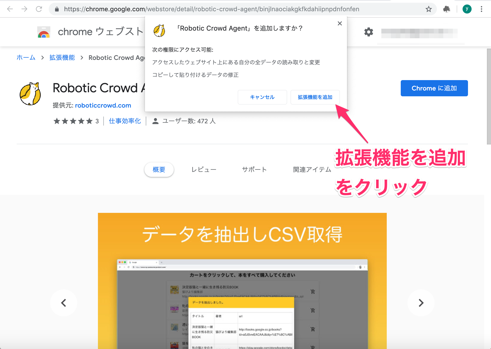
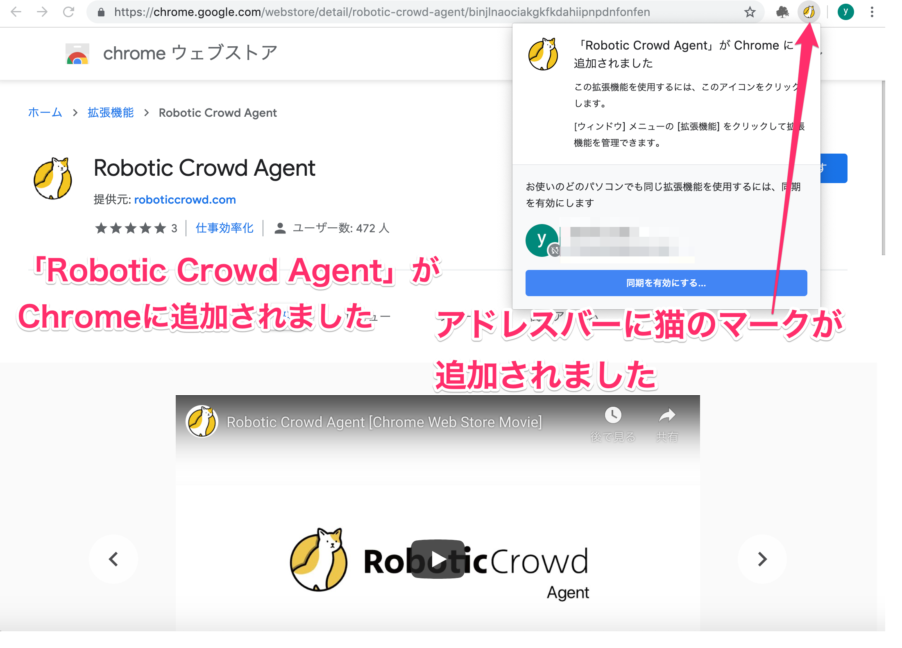

# インストール方法

## 概要

Robotic Crowd Agent をインストールする方法を説明します。

Robotic Crowd Agent を使用するためには、Chrome に Robotic Crowd Agent という拡張機能をインストールする必要があります。 今回はインストール方法を説明します。

では、始めましょう。

### このチュートリアルのゴール

Robotic Crowd Agent という拡張機能をインストールして、Robotic Crowd Agent を使用できる環境を作る。

### 手順

1. インストールを申請するページを開く
2. 必要事項を記入し、インストールする
3. 送られてくるメール内のリンクをクリックする
4. Robotic Crowd Agent がインストールされていることを確認する

### 1. インストールを申請するページを開く

[拡張機能インストールページ](https://docs.roboticcrowd.com/robotic-crowd-agent/install-agent) を開きます。

### 2. 必要事項を記入し、インストールする

開いたページで、下にスクロールしていくと拡張機能インストール方法が出てきます。 「姓」「名」「会社名」「E-mail」「電話番号」「コメント」を入力してください。

上の必要事項を入力していただきましたら、「拡張機能をインストールする」ボタンをクリックしてください。

「拡張機能をインストールする」ボタンをクリックすると、下の画面が出てきます。インストールの申請が完了しました。

### 3. 送られてくるメール内のリンクをクリックする

インストールの申請が完了すると、株式会社チュートリアルから、必要事項で入力していただいたE-mailアドレス宛に、件名「【無料 Google Chrome拡張機能】インストールリンクです」が届きます。メールを開いて、リンクをクリックしてください。

リンクをクリックすると、chrome ウェブストアのページが開きます。ページ右上にある「Chrome に追加」ボタンをクリックしてください。

「Robotic Crowd Agent」を追加しますか？と出てきますので、「拡張機能を追加」をクリックしてください。 「拡張機能を追加」をクリックすると、インストールが完了します。

Chrome に Robotic Crowd Agent という拡張機能をインストールすることができました。

### 4. Robotic Crowd Agent がインストールされていることを確認する

Robotic Crowd Agent がインストールされていることを確認します。

「Robotic Crowd Agent」が Chrome に追加されました、と表示されます。 また、アドレスバーの右側に猫のマークが追加されています。

これでインストールは完了しました。

以上で、Chrome に Robotic Crowd Agent という拡張機能をインストールする方法の説明を終わります。

お疲れ様でした。

Robotic Crowd Agent のプライバシーポリシーは [こちら](https://roboticcrowd.com/privacy-policy/) です。

Robotic Crowd Agent を使うことができるようになりましたので、次回の記事から実際にRobotic Crowd Agent の使い方を説明していきます。

