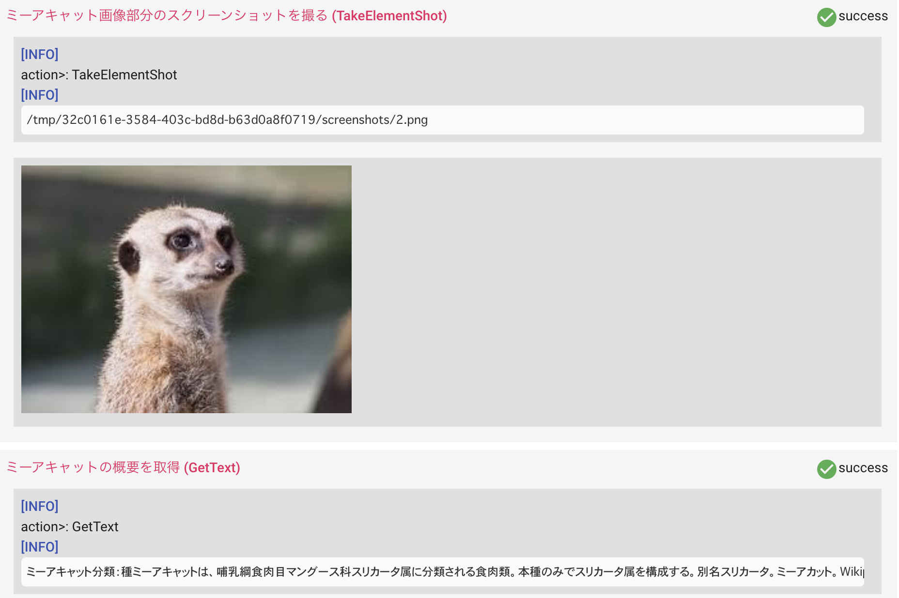

# ロボットを動かしてみる

すぐに Robotic Crowd を始める方法。Visual Modeの使いかたは、[https://intercom.help/roboticcrowd](https://intercom.help/roboticcrowd) のGuide記事の方を参照してください。

## 5分で体験する Robotic Crowd

### Yamlの設定ファイルのコピーによるワークフローの

次のワークフローは、Yahoo! Japan でミーアキャットを検索した結果を取得するワークフローのサンプルです。

```yaml
# Yahoo! Japan を開く
+open_browser_1:
  action>: OpenBrowser
  url: 'https://www.yahoo.co.jp/'

# 検索フィールドにミーアキャットを入力
+type_text_1:
  action>: TypeText
  browser: +open_browser_1
  selector: 'input#srchtxt'
  text: 'ミーアキャット'
  clearValue: false

# 検索ボタンをクリック
+click_1:
  action>: Click
  browser: +type_text_1
  selector: 'input#srchbtn'

# 検索結果のスクリーンショットを撮る
+take_screenshot_1:
  action>: TakeScreenshot
  browser: +click_1
  full_page: false

# ミーアキャット画像部分のスクリーンショットを撮る
+take_element_shot_1:
  action>: TakeElementShot
  browser: +click_1
  selector: 'div#sIn div.gglImg.visible > a > img'
  ignoreError: false

# ミーアキャットの概要を取得
+get_text_1:
  action>: GetText
  browser: +click_1
  selector: 'div#sIn div.bd_9'
```

このワークフローをコピーして、Robotic Crowd で新規に作成したワークフローにエディターモードでペーストしてください。エディターモードからヴィジュアルモードへ切り替える（エディターモードをOFFにする）とGUIでも同様に定義が反映されていることがわかると思います。

### 実行してみましょう

ペーストして実行するとすぐにロボットが起動し、実行を開始します。データを取得してくる主要部分のログは、次のように出ていると思います。




