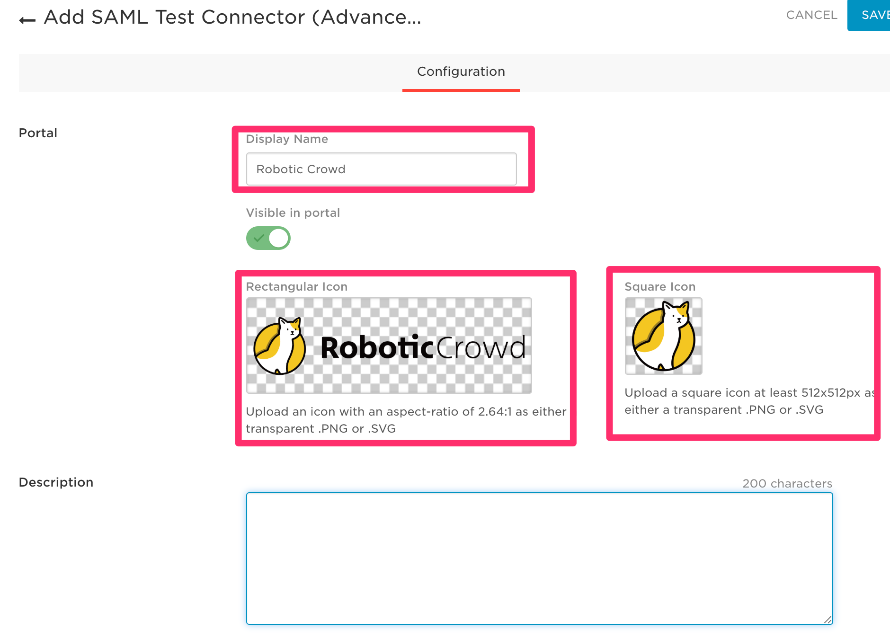
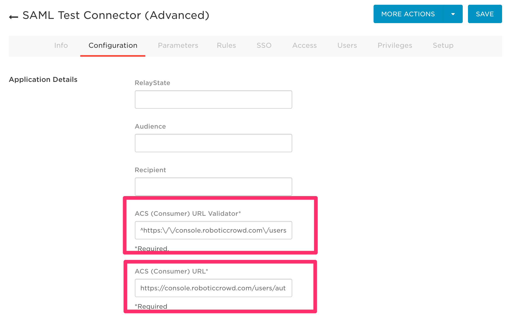
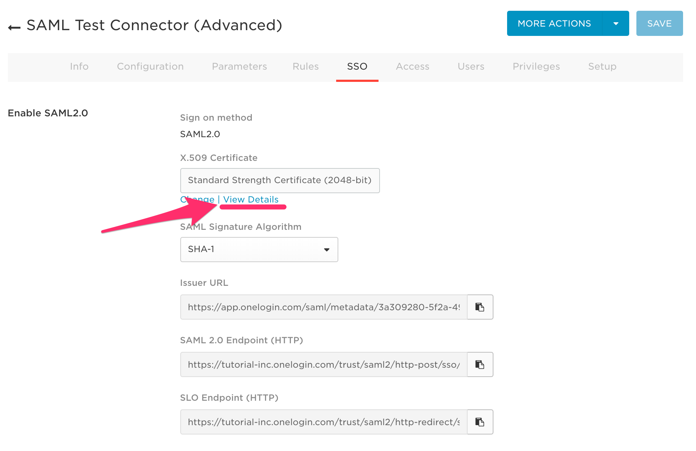
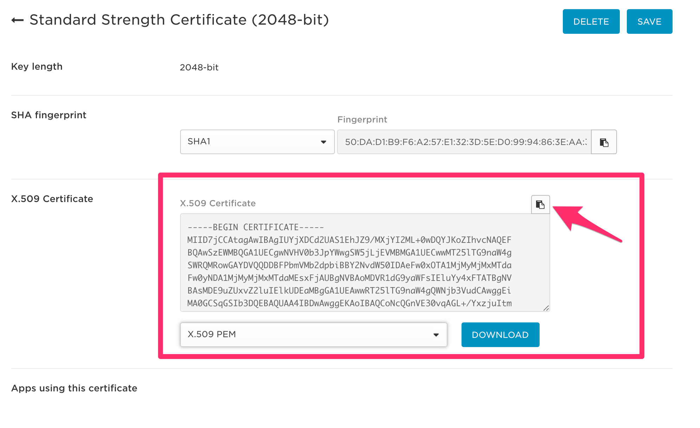

# OneLogin

このセクションでは、OneLoginを使って、Robotic Crowd に SSO する方法を説明いたします。**設定には、管理者権限が必要**ですので、情報システム部門の担当者に依頼してください。

### この作業のゴールと手順

#### 手順

OneLogin側で、以下の項目を設定します。

1. 新規 SAML アプリケーションの登録
2. 弊社担当者から指定されたACSの登録
3. 弊社担当者より指定された ACS URL Validator の登録
4. 証明書とログインURLのコピー

#### ゴール

上記手順を実際に行って以下の情報を取得して、弊社担当者までご連絡ください。

* X.509 Certificate
* SAML 2.0 Endpoint \(URL\)

では一つずつ手順を説明します。

### 新規 SAML アプリケーションの登録

管理者権限でログインして、管理画面に入ります。そこで、Add Apps を選択してください。

続いて、アプリケーションを検索するところから、SAML Test を検索します。このSAML Testというアプリケーションを編集して Robotic Crowd 用のSAMLアプリケーションを作成します。

検索結果から、SAML Test Connector という物を選択してクリックします。

すると、アプリケーション名や説明を記入する画面になるので、Display Name に Robotic Crowd、Rectangular icon / Square icon に次の画像をそれぞれ指定してください。Descriptionの部分には、社内向けの説明を記入してください。記入したら Save してください。

### ACSとACS URL Validatorを登録

Configurationタブをクリックして設定画面を開きます。ここで、ACSとACS URL Validatorを登録します。それぞれフォーマットは以下のようになっています。

| 項目 | 値 |
| :--- | :--- |
| ACS | https://console.roboticcrowd.com/users/auth/saml?domain=\[yourdomain\] |
| ACS URL Validator | ^https:\/\/console\.roboticcrowd\.com\/users\/auth\/saml?domain=\[yourdomain\]$ |

値は、営業担当より連絡いたします。設定してSaveしてください。

### 証明書とログインURLのコピー

この状態でSSOタブを開くと、各種値を取得することができます。まずは、SAML 2.0 Endpointをコピーしてください。

続いて、X.509 Certificateというところの下の "View Details" をクリックして証明書の詳細を開いてください。

クリック後に表示される画面から、証明書をコピーしてください。

上で取得した以下の情報を弊社担当者までおしらせください。データは、テキストで大丈夫です。

* SAML 2.0 Endpoint
* X.509 Certificate

